# 浏览器是如何渲染web页面的？

[[toc]]

> 原文：[how-the-browser-renders-a-web-page](https://medium.com/jspoint/how-the-browser-renders-a-web-page-dom-cssom-and-rendering-df10531c9969)

每当你在开发一个网站时，有一些事情对于**好的用户体验**是非常重要的。一个网站可能遇到的一些常见问题有：**资源加载缓慢**，**在初次渲染时等待不必要的文件下载**，  **无风格的内容闪现**(FOUC)等等。为了避免这些问题，我们需要了解浏览器如何渲染一个典型网页的生命周期。

首先，我们需要了解什么是**DOM**。当浏览器向服务器发送请求以获取一个HTML文档时，服务器会返回一个**二进制流格式**的HTML页面，这基本上是一个文本文件，其响应头`Content-Type`被设置为`text/html; charset=UTF-8`。

这里`text/html`是一个[**MIME Type**](https://en.wikipedia.org/wiki/Media_type)，它告诉浏览器这是一个HTML文档，`charset=UTF-8`告诉浏览器它是以[**UTF-8**](https://en.wikipedia.org/wiki/UTF-8)字符编码进行[编码](https://medium.com/jspoint/introduction-to-character-encoding-3b9735f265a6) 的。利用这些信息，浏览器可以将二进制格式转换成可读的文本文件。这在下面的屏幕截图中显示。

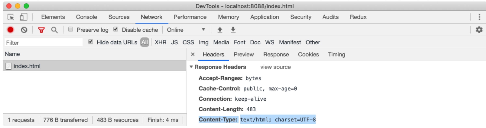

如果缺少这个头，浏览器就不知道如何处理该文件，它将以纯文本格式呈现。但是，如果一切正常，经过这样的转换，浏览器就可以开始读取HTML文档了。一个典型的HTML文档可以是这样的。

```html
<!DOCTYPE HTML>
<html>
    <head>
        <title>Rendering Test</title>
      
        <!-- stylesheet -->
        <link rel="stylesheet" href="./style.css"/>
    </head>
    <body>
        <div class="container">
          <h1>Hello World!</h1>
          <p>This is a sample paragraph.</p>
        </div>
      
        <!-- script -->
        <script src="./main.js"></script>
    </body>
</html>
```

在上述文件中，我们的网页依赖于`style.css`为HTML元素提供样式，`main.js`执行一些JavaScript操作。通过一些整洁的CSS样式，我们的上述网页将看起来像这样。

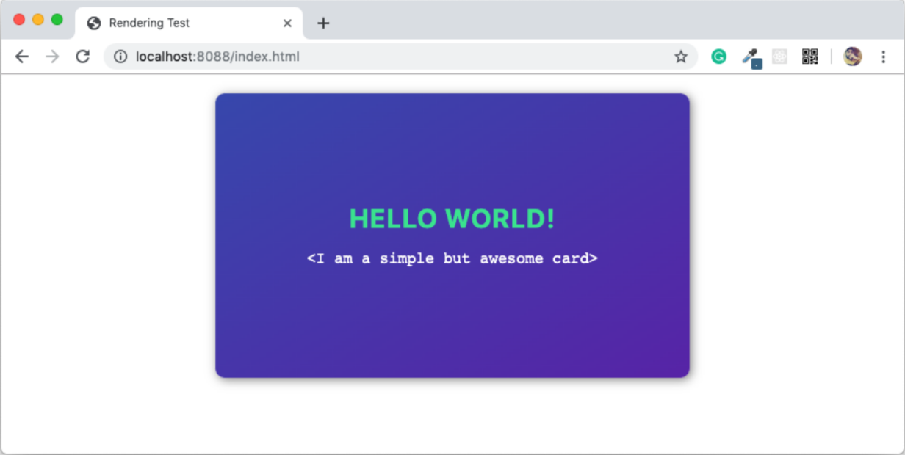

但问题仍然存在，浏览器是如何从一个只包含文本的简单HTML文件中渲染出这个漂亮的网页的？为此，我们需要了解什么是**DOM**，**CSSOM，**和**Render Tree**？

## **文档对象模型(DOM)**

当浏览器读取HTML代码时，每当遇到像`html`、`body`、`div`等HTML元素时，就会创建一个叫做[**Node**](https://developer.mozilla.org/en-US/docs/Web/API/Node)的JavaScript对象。最终，所有的HTML元素都会被转换为JavaScript对象。

由于每个HTML元素都有不同的属性，Node对象将从不同的类（*构造函数*）创建。例如，`div`元素的Node对象是由`HTMLDivElement`创建的，它**继承**了 `Node`类。对于我们早期的HTML文档，我们可以用一个简单的测试来可视化这些节点，如下所示。

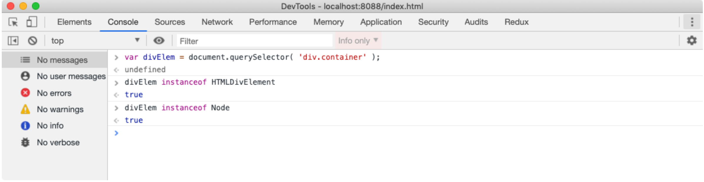

浏览器有内置的类，如`HTMLDivElement`、`HTMLScriptElement`、`Node`等。

浏览器从HTML文件中创建了节点后，必须将这些节点对象创建成一个**树状结构**。由于我们的HTML文件中的HTML元素是相互嵌套的，浏览器需要复制这一点，但要使用它之前创建的Node对象。这将有助于浏览器在整个生命周期内有效地渲染和管理网页。

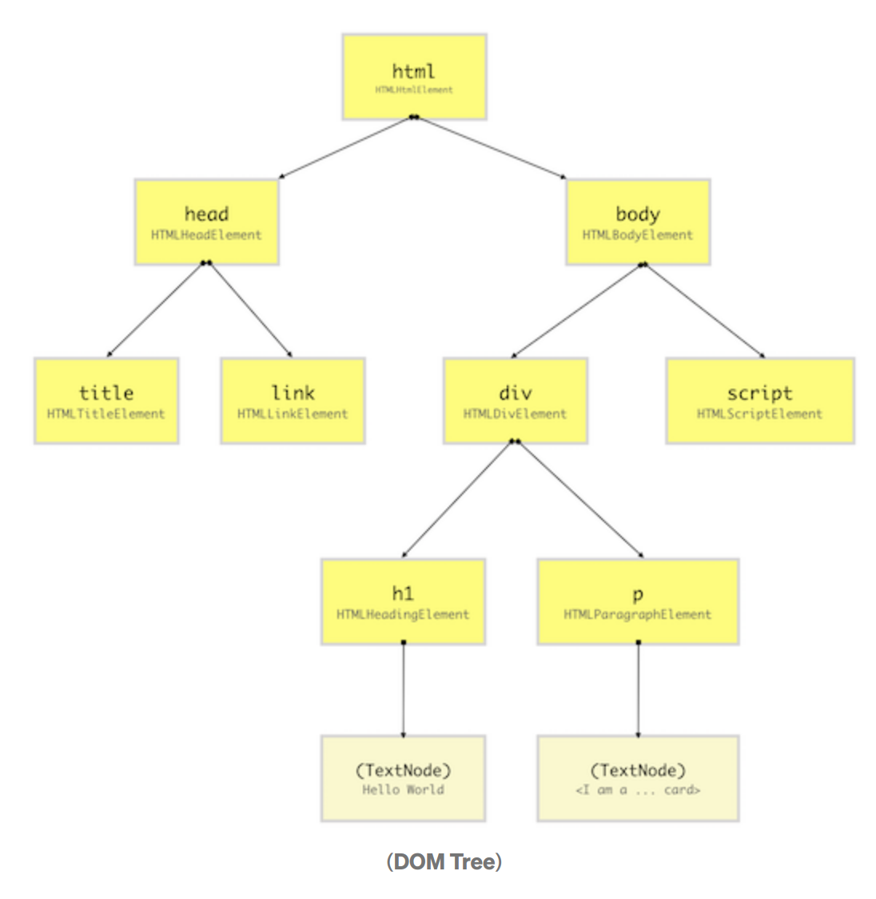


我们早期的HTML文档的[**DOM**](https://developer.mozilla.org/en-US/docs/Web/API/Document_Object_Model)树看起来像上面一样。一个DOM树从最上面的元素开始，也就是`html`元素，然后根据文档中HTML元素的出现和嵌套情况进行分支。每当发现一个HTML元素，它就从其各自的类（*构造函数*）创建一个DOM节点（*Node*）对象。

> 💡一个DOM节点不一定是一个HTML元素。当浏览器创建一个DOM树时，它也会将[注释](https://developer.mozilla.org/en-US/docs/Web/API/Comment)、[属性](https://developer.mozilla.org/en-US/docs/Web/API/Attr)、[文本](https://developer.mozilla.org/en-US/docs/Web/API/Text)等东西作为单独的节点保存在树上。但为了简单起见，我们将只考虑HTML元素的DOM节点，又称**DOM元素**。[**这里**](https://www.w3schools.com/jsref/prop_node_nodetype.asp)是所有DOM节点类型的列表。

你可以在**Google Chrome DevTools Console**中直观地看到DOM树，如下图所示。这将显示DOM元素的层次结构（*DOM树的高层视图*）以及每个DOM元素的属性。

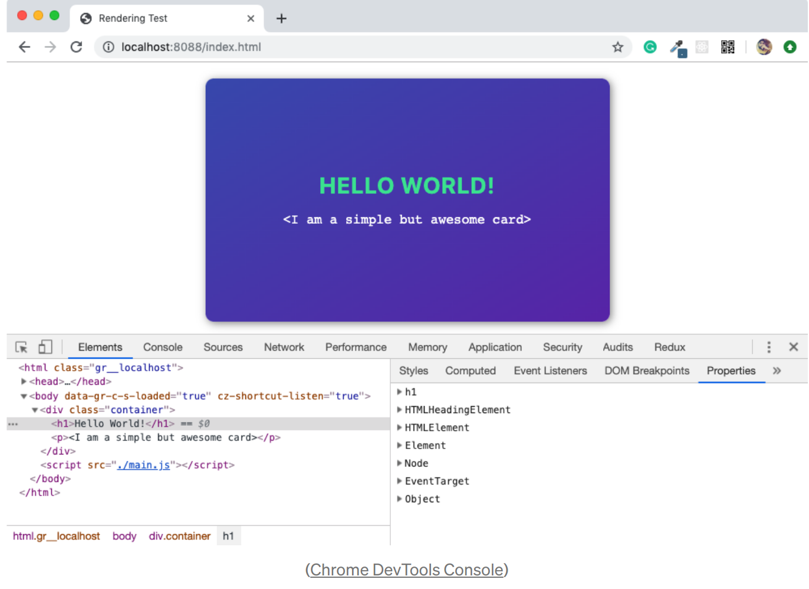

JavaScript不理解DOM是什么，它不是JavaScript规范的一部分。DOM是浏览器提供的一个高级[**Web API**](https://developer.mozilla.org/en-US/docs/Web/API)，用于有效地渲染网页，并将其公开，以便开发者出于各种目的动态地操作DOM元素。

> *💡* 使用DOM API，开发者可以添加或删除HTML元素，改变其显示或绑定事件监听器。使用DOM API，HTML元素可以在内存中创建或克隆，并在不影响渲染的DOM树的情况下进行替换。这使开发者有能力构建具有丰富用户体验的高度动态网页。

## **CSS对象模型 (CSSOM)**

当我们设计一个网站时，我们的目的是让它尽可能的好看。而我们通过为HTML元素提供一些样式来做到这一点。在HTML页面中，我们使用[**CSS**](https://developer.mozilla.org/en-US/docs/Web/CSS)为HTML元素提供样式，它代表**层叠样式表**。使用CSS[选择器](https://developer.mozilla.org/en-US/docs/Web/CSS/CSS_Selectors)，我们可以针对DOM元素，为样式属性设置一个值，如`颜色`或`字体大小`。

对HTML元素应用样式有不同的方法，如使用外部CSS文件、使用`<style>`标签嵌入CSS、使用HTML元素上的`style`属性的内联方法或使用JavaScript。但最终，浏览器必须完成将CSS样式应用到DOM元素的重任。

比方说，对于我们前面的例子，我们将使用下面的CSS样式（*这不是截图中显示的卡片所用的CSS*）。为了简单起见，我们不打算纠结于如何在HTML页面中导入CSS样式。

```css

html {
    padding: 0;
    margin: 0;
}

body {
    font-size: 14px;
}

.container {
    width: 300px;
    height: 200px;
    color: black;
}

.container > h1 {
    color: gray;
}

.container > p {
    font-size: 12px;
    display: none;
}
```

在构建DOM之后，浏览器从所有的来源（*外部、嵌入、内联、用户代理等*）读取CSS，并构建一个[**CSSOM**](https://developer.mozilla.org/en-US/docs/Web/API/CSS_Object_Model)。CSSOM是**CSS对象模型**的缩写，与DOM一样，是一种树状结构。

这个树中的每个节点都包含CSS样式信息，这些信息将应用于它所针对的DOM元素（*由选择器指定*）。然而，CSSOM不包含不能在屏幕上打印的DOM元素，如`<meta>`、`<script>`、`<title>`等。

我们知道，大多数浏览器都有自己的样式表，称为[**用户代理样式表 user agent stylesheet**](https://stackoverflow.com/questions/12582624/what-is-a-user-agent-stylesheet)，浏览器首先通过用开发者属性提供的CSS覆盖用户代理样式来计算DOM元素的最终CSS属性（[*使用特殊性规则*](https://developer.mozilla.org/en-US/docs/Web/CSS/Specificity)），然后构造一个节点。

即使一个特定的HTML元素的CSS属性（如`显示`）没有被开发者或浏览器定义，它的值也会被设置为[**W3C CSS**](https://www.w3.org/Style/CSS/)标准规定的该属性的**默认值**。在选择CSS属性的默认值时，如果一个属性符合[**W3C文档**](https://www.w3.org/TR/CSS1/#inheritance)中提到的继承条件，则会使用一些**继承**的规则。

例如，`color`和`font-size`等，如果一个HTML元素缺少这些属性，就会继承父元素的值。所以你可以想象，在一个HTML元素上有这些属性，它的所有子元素都会继承它。这就是所谓的**层叠样式**，这就是为什么CSS是**层叠样式表**的首字母缩写。这也是浏览器构建CSSOM的根本原因，CSSOM是一个树状结构，根据CSS层叠规则来**计算样式**。

> *💡* 你可以通过Chrome DevTools控制台的**元素**面板看到一个HTML元素的计算样式。从左侧面板选择任何HTML元素，然后点击右侧面板上的**计算**标签。

我们可以用下图来说明我们前面例子中的CSSOM树。为了简单起见，我们将忽略用户代理样式，而专注于前面提到的CSS样式。

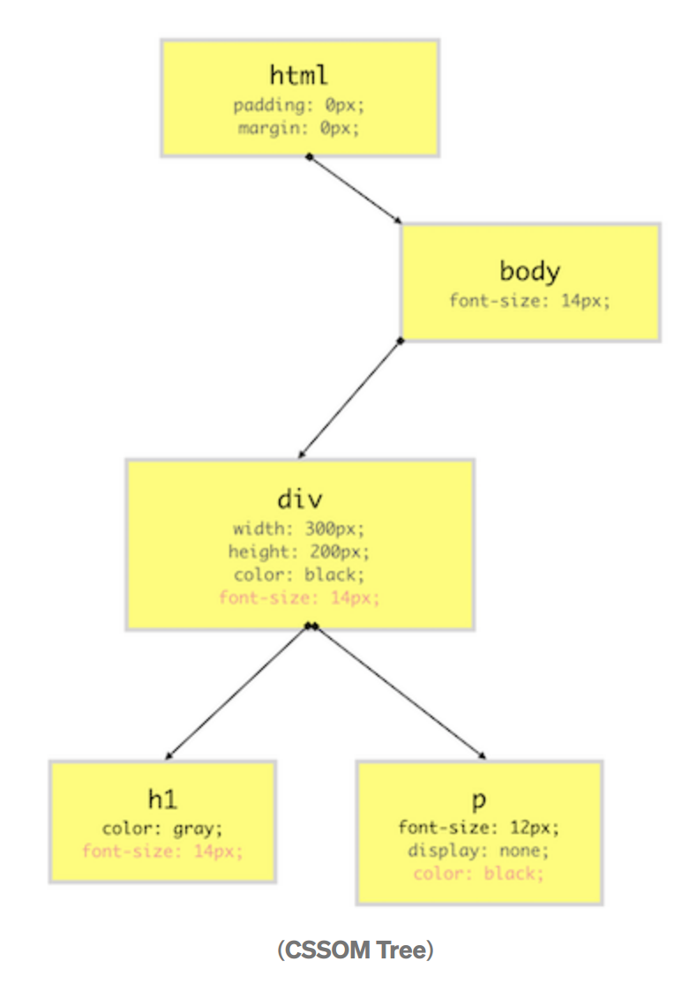


从上图中你可以看到，我们的CSSOM树不包含像\<link>、\<title>、\<script>等不被打印在屏幕上的元素。红色的CSS属性值是从顶部层叠下来的，而灰色的属性值是凌驾于继承值之上的。

## 渲染树(**Render Tree**)

Render-Tree也是一种树状结构，由DOM和CSSOM树结合在一起构建。浏览器必须计算每个可见元素的**布局**，并将它们**绘制**在屏幕上，因为该浏览器使用这个Render-Tree。因此，除非Render-Tree没有被构建，否则任何东西都不会被绘制在屏幕上，这就是为什么我们需要DOM和CSSOM树。

由于Render-Tree是对最终将被打印在屏幕上的东西的低级表示，它不会包含在像素矩阵中不包含任何区域的节点。例如，`display:none;`元素的尺寸为`0px X 0px`，因此它们不会出现在Render-Tree中。

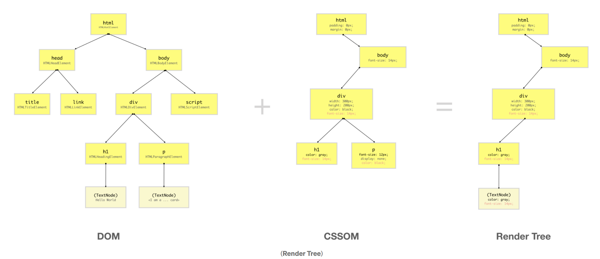

从上图可以看出，Render-Tree结合了DOM和CSSOM，生成了一个树状结构，只包含将被绘制在屏幕上的元素。

由于在CSSOM中，位于`div`内的`p`元素被设置为`display:none;`样式，它和它的子元素不会出现在Render-Tree中，因为它在屏幕上不占空间。然而，如果你有`visibility:hidden`或`opacity:0`的元素，它们将在屏幕上占据空间，因此它们将出现在Render-Tree中。

与DOM API不同的是，DOM API允许访问浏览器构建的DOM树中的DOM元素，而CSSOM则对用户是隐藏的。但是，由于浏览器将DOM和CSSOM结合起来形成了渲染树，所以浏览器通过提供DOM元素本身的高级API来公开DOM元素的CSSOM节点。这使得开发者能够访问或改变CSSOM节点的CSS属性。

> *💡* 由于使用JavaScript操作元素的样式超出了本文的范围，所以这里有一个链接，可以看到涵盖了CSSOM API的广泛内容的[**CSS技巧文章**](https://css-tricks.com/an-introduction-and-guide-to-the-css-object-model-cssom/)。我们还有新的[**CSS Typed Object**](https://developers.google.com/web/updates/2018/03/cssom) API，它是处理元素样式的更精确的方法。

## 渲染顺序(Rendering Sequence )

现在我们已经很好地理解了什么是DOM、CSSOM和Render-Tree，让我们来了解一下浏览是如何使用它们渲染一个典型的网页的。对这一过程有一个最基本的了解，对任何网络开发者来说都是至关重要的，因为它将帮助我们设计网站，以获得最大的用户体验（UX）和性能。

当一个网页被加载时，浏览器首先读取HTML文本并从中构建DOM树。然后，它处理CSS，不管是内联的、嵌入的还是外部的CSS，并从中构造出CSSOM树。

在这些树构建完成后，它又从中构建出了Render-Tree。一旦Render-Tree构建完成，浏览器就开始在屏幕上绘制各个元素。

### 布局操作(Layout operation)——对渲染树中的单个节点进行布局

首先浏览器创建每个单独的Render-Tree节点的布局。布局包括**每个节点的尺寸**（像素）和它在屏幕上的绘制位置（*位置*）。这个过程被称为**布局**，因为浏览器正在计算每个节点的布局信息。

这个过程也被称为**回流(reflow)**或**浏览器回流(browser reflow)**，当你**滚动**、**调整窗口大小**或**操纵DOM**元素时，它也会发生。这里有一个[**列表**](https://stackoverflow.com/a/27637245/2790983)的事件，可以触发元素的**铺展/回流**。

> *💡* 我们应该避免网页因为微不足道的原因而进行多次布局操作，因为这是一个昂贵的操作。[**这里**](https://developers.google.com/web/fundamentals/performance/rendering/avoid-large-complex-layouts-and-layout-thrashing)是[Paul Lewis](https://twitter.com/aerotwist)的一篇文章，他谈到了我们如何避免复杂而昂贵的布局操作，以及[**布局激动(layout thrashing)**](https://kellegous.com/j/2013/01/26/layout-performance/)。

### **绘制操作(Paint operation)**——绘制各个图层

到目前为止，我们有一个需要打印在屏幕上的几何图形的列表。由于Render-Tree中的**元素**（*或一个子树*）可以相互重叠，而且它们可以有CSS属性，使它们经常改变外观、位置或几何形状（如*动画*），所以浏览器为它创建了一个**层**。

创建图层有助于浏览器在网页的整个生命周期内有效地进行绘制操作，例如在滚动或调整浏览器窗口大小时。拥有图层也有助于浏览器按照开发者的意图，正确地以堆叠顺序（*沿Z轴*）绘制元素。

现在我们有了图层，我们可以把它们结合起来，在屏幕上**画**。但是，浏览器不会一次就画出所有的图层。每个图层都是先单独绘制的。

在每个图层中，浏览器为元素的任何可见属性（如边框、背景色、阴影、文本等）填充单个像素。这个过程也被称为**光栅化**。为了提高性能，浏览器可以使用不同的**线程**来进行光栅化处理。

**Photoshop**中的图层类比，也可以应用于浏览器渲染网页的方式。你可以通过Chrome DevTools将网页上的不同层可视化。打开DevTools，从**更多工具**选项中，选择**图层**。你也可以从**渲染**面板上看到层的边界。

> *💡* 栅格化通常是在CPU中完成的，这使得它很慢而且很昂贵，但我们现在有新的技术可以在GPU中完成，以提高性能。这篇[**intel article**](https://software.intel.com/en-us/articles/software-vs-gpu-rasterization-in-chromium)详细介绍了**绘制**的主题，是必须阅读的。要详细了解图层的概念，[**这篇**](https://www.html5rocks.com/en/tutorials/speed/layers/)是一篇必须阅读的文章。

### 合成操作(Compositing operation)——（利用GPU）合成各个图层

到目前为止，我们还没有在屏幕上绘制一个像素。我们所拥有的是不同的图层（*bitmap图像*），它们应该按照特定的顺序绘制在屏幕上。在**合成**操作中，这些图层被发送到GPU，最终在屏幕上绘制。

发送整个图层来绘制显然是低效的，因为每次有**回流**(*layout*)或[**重绘**](https://stackoverflow.com/questions/2549296/whats-the-difference-between-reflow-and-repaint)时都必须这样做。因此，一个图层被分解成不同的**瓷砖(tiles)**，然后将在屏幕上绘制。你也可以在Chrome的DevTool渲染面板中直观地看到这些瓷砖。

从上述信息中，我们可以构建一个浏览器从一个网页到在屏幕上呈现事物的事件序列，从简单的HTML和CSS文本内容。

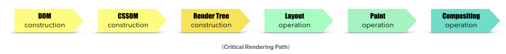

这一系列事件也被称为[**关键渲染路径(CRP,critical rendering path)**](https://developer.mozilla.org/en-US/docs/Web/Performance/Critical_rendering_path)。

> *💡* [小坂真理子](https://twitter.com/kosamari)写了一篇关于这个过程的[**美丽的文章**](https://developers.google.com/web/updates/2018/09/inside-browser-part3)，有很酷的插图和对每个概念更广泛的解释。强烈推荐。

### 浏览器引擎(Browser engines)

创建DOM树、CSSOM树和处理渲染逻辑的工作是通过一个叫做[**浏览器引擎**](https://en.wikipedia.org/wiki/Browser_engine)（*也被称为***渲染引擎** *或***布局引擎**）的软件完成的，它驻留在浏览器内。这个浏览器引擎包含所有必要的元素和逻辑，将网页从HTML代码渲染成屏幕上的实际像素。

如果你听到人们谈论[**WebKit**](https://en.wikipedia.org/wiki/WebKit)，他们是在谈论一个浏览器引擎。**WebKit**被苹果的Safari浏览器使用，并且是谷歌Chrome浏览器的默认渲染引擎。截至目前，[**Chromium**](https://en.wikipedia.org/wiki/Chromium_(web_browser))项目使用[**Blink**](https://en.wikipedia.org/wiki/Blink_(browser_engine))作为默认渲染引擎。[**这里有一个列表**](https://stackoverflow.com/a/3468311/2790983)是一些顶级网络浏览器所使用的不同的浏览器引擎。

## 浏览器中的渲染进程(**Rendering Process in browsers**)

我们都知道，JavaScript语言是通过[**ECMAScript**](https://en.wikipedia.org/wiki/ECMAScript)标准来规范的，事实上，由于[JavaScript是注册商标](https://dev.to/theoutlander/oracle-owns-the-trademark-to-javascript-1fil)，我们现在只叫它ECMAScript。因此，每一个JavaScript引擎供应商，如[**V8**](http://v8.dev/)、[**Chakra**](https://en.wikipedia.org/wiki/Chakra_(JavaScript_engine))、[**Spider Monkey**](https://developer.mozilla.org/en-US/docs/Mozilla/Projects/SpiderMonkey)等，都必须遵守这个标准的规定。

有了一个标准，我们就可以在所有的JavaScript运行时（如浏览器、Node、Deno等）中获得一致的JavaScript体验。这对于多平台的JavaScript（*和网络*）应用程序的一致和无缺陷的开发是非常好的。

**然而，浏览器渲染事物的方式却不是这样的。HTML、CSS或JavaScript，这些语言是由某个实体或某个组织标准化的。然而，浏览器如何将它们结合在一起在屏幕上呈现东西，却没有标准化。谷歌浏览器的引擎与Safari浏览器的引擎做的事情可能不一样。**

因此，我们很难预测某个特定浏览器的渲染顺序及其背后的机制。不过，[HTML5规范](https://html.spec.whatwg.org/)已经做出了一些努力，在理论上规范了[**渲染**](https://html.spec.whatwg.org/multipage/rendering.html)应该如何工作，但浏览器如何遵守这一标准，完全取决于它们。

尽管有这些不一致的地方，但有一些共同的原则，通常在所有的浏览器中都是一样的。让我们来了解一下浏览器在屏幕上渲染东西的常用方法以及这个过程的生命周期事件。为了了解这个过程，我准备了一个[**小项目**](https://github.com/course-one/browser-rendering-test)来测试不同的渲染方案（*下面*个链接）。

[course-one/browser-rendering-test](https://github.com/course-one/browser-rendering-test/tree/master)

### 解析和外部资源（Parsing and External Resources）

**解析**是读取HTML内容并从中构建一个DOM树的过程。因此，这个过程也被称为**DOM解析**，做这个工作的程序被称为**DOM解析器**。

大多数浏览器都提供了`DOMParser`网络应用程序接口，以便从HTML代码中构建一个DOM树。`DOMParser`类的一个实例代表一个DOM解析器，使用 `parseFromString`原型方法，我们可以将原始的HTML文本（*代码*）解析成一个DOM树（*如下图所示*）。

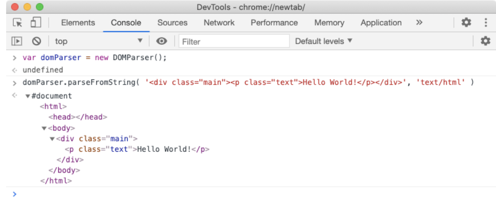

当浏览器请求一个网页，而服务器响应一些HTML文本（有`Content-Type` *header设置为`text/html`*）时，只要有几个字符或整个文档的几行，浏览器就可以开始**解析**HTML。因此，浏览器可以**递增地**建立DOM树，一次一个**节点**。浏览器对HTML的解析是由上至下的，而不是在中间的任何地方，因为HTML代表了一个嵌套的树状结构。


在上面的例子中，我们从Node服务器上访问了`incremental.html`文件，并将网络速度设置为只有**10kbps**（从网络面板*）。由于浏览器加载（*下载*）这个文件需要很长时间（*因为它包含1000个`h1`元素*），浏览器从最初的几个字节构建一个DOM树，并将它们打印在屏幕上（*因为它在后台下载HTML文件的剩余内容*）。

如果你看一下上述请求的**性能**图，你就能在**计时**行看到一些**事件**。这些事件通常被称为[**性能指标**](https://web.dev/user-centric-performance-metrics/#important-metrics-to-measure)。当这些事件被放置在**尽可能接近**的地方，并**尽可能早**地发生，更好的**用户体验**。

> *💡* 使用`性能`选项卡中的**⟳**图标来捕捉性能曲线。

`FP`是**First Paint**的缩写，指的是浏览器开始在屏幕上绘制东西的时间（*可能是简单到body背景颜色的第一个像素*）。

`FCP` 是**First Contentful Paint**的缩写，指的是浏览器呈现内容（如**文本**或**图像**）的第一个像素的时间。`LCP` 是 **Largest Contentful Paint**的缩写，指的是浏览器呈现大段文字或图像的时间。

> *💡* 你可能听说过**FMP**（*first meaningful paint 首次有意义的绘制*），这也是一个类似于**LCP**的指标，但它已被Chrome浏览器放弃，转而采用**LCP**。

`L`代表 `onload`事件，是由浏览器在 `window`对象上发出的。同样，`DCL`代表`DOMContentLoaded`事件，它是在`document`对象上发出的，但它会涌向`window`，因此你也可以在`window`上监听它。这些事件的理解有点复杂，所以我们将稍稍讨论一下。

每当浏览器遇到一个**外部资源**，例如通过`<script src="url">/script>`元素的**脚本**文件（*JavaScript*），通过`<link rel="stylesheet" href="url"/>`标签的**样式表**文件（*CSS*），通过``元素的图像文件或任何其他外部资源，浏览器将在后台开始下载该文件（*远离JavaScript执行的***主线程**）。

最重要的是要记住，DOM解析通常发生在**主线程**上。因此，如果JavaScript的主执行线程很忙，DOM解析将不会进行，直到该线程空闲。你可能会问，为什么这一点如此重要？因为 `脚本`元素是**解析器阻断的（parser-blocking）**。除了脚本（`.js`）文件请求，每一个外部文件请求，如**图片**、**样式表**、**pdf**、**视频**等，都不会阻塞DOM构建（**解析**）。

### 阻断解析器的脚本(Parser-Blocking Scripts)

一个**解析器阻断脚本**是一个脚本（*JavaScript*）文件/代码，它停止了对HTML的解析。当浏览器遇到一个 "脚本 "元素时，如果它是一个嵌入的脚本，那么它将**执行**该脚本，然后继续解析HTML以构建DOM树。因此，所有的**嵌入式脚本都是解析器阻塞的**，讨论结束。

如果 `script`元素是一个**外部脚本文件**，浏览器将在主线程之外开始下载外部脚本文件，但它将**停止主线程的执行**，直到该文件下载完毕。这意味着在下载脚本文件之前不会再进行DOM解析。

一旦脚本文件被下载，浏览器将首先在主线程上**执行**下载的脚本文件（*明显*），然后继续进行DOM解析。如果浏览器再次发现HTML中的另一个 `脚本`元素，它将执行同样的操作。那么，为什么浏览器要停止DOM解析，直到JavaScript被下载和执行？

浏览器将DOM API暴露给JavaScript运行时，这意味着我们可以从JavaScript中访问和操作DOM元素。这就是诸如**React**和**Angular**等动态网页框架的工作方式。但是，如果浏览器希望**平行**地运行DOM解析和脚本执行，那么在DOM解析器线程和主线程之间可能存在[**竞赛条件**](https://stackoverflow.com/questions/34510/what-is-a-race-condition)，这就是为什么DOM解析必须发生在主线程上。

然而，在大多数情况下，在后台下载脚本文件时停止 DOM 解析是完全不必要的。因此，HTML5为`script`标签提供了`async`属性。当DOM解析器遇到带有`async`属性的外部`script`元素时，它不会在后台下载脚本文件时停止解析过程。但是一旦该文件被下载完成，解析就会停止，脚本（*代码*）将被执行。

我们还有一个神奇的`defer`属性用于`script`元素，其工作原理与`async`属性类似，但与`async`属性不同的是，即使文件被完全下载，脚本**也不执行**。所有的`defer`脚本都是在解析器解析完所有HTML后执行的，这意味着DOM树已经完全构建完毕。与`async`脚本不同，所有`defer`脚本都是按照它们在HTML文档（*或DOM树*）中出现的顺序执行。

所有正常的脚本（*嵌入式或外部*）都是**解析器阻塞的**，因为它们会停止DOM的构建。所有的`async`脚本（*即 异步脚本*）在被下载之前不会阻塞解析器。一旦`async`脚本被下载完成，它就会成为解析器阻塞的对象。然而，所有的`defer`脚本（*即 deferred scripts*）都是**非解析器阻塞的**脚本，因为它们不会阻塞解析器，而是在DOM树被完全构建后执行。


在上面的例子中，`parser-blocking.html`文件在30个元素之后包含一个**parser-blocking**脚本，这就是为什么浏览器一开始显示30个元素，停止DOM解析，并开始加载脚本文件。第二个脚本文件不会阻止解析，因为它有`defer`属性，所以一旦DOM树被完全构建，它就会执行。

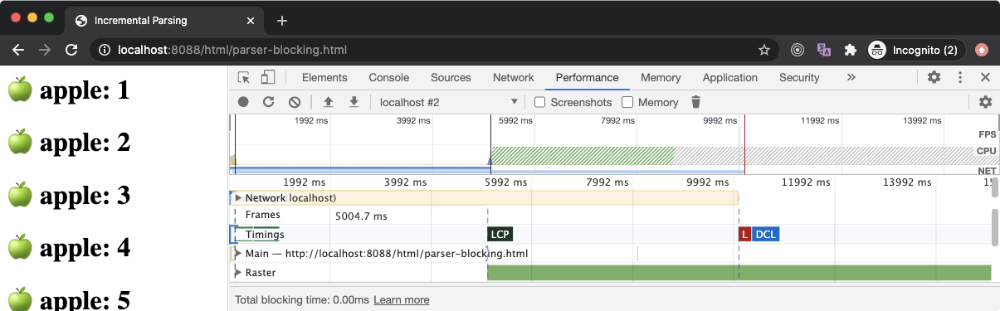

如果我们看一下**性能**面板，`FP`和 `FCP`会尽快发生（*隐藏在***Timings**  *label*后面），因为一旦有了一些HTML内容，浏览器就开始建立一个DOM树，因此它可以在屏幕上渲染一些像素。

`LCP`在5秒后发生，因为解析器阻断脚本阻断了DOM解析5秒（*其下载时间*），当DOM解析器被阻断时，只有30个文本元素被渲染在屏幕上，这不足以被称为最大内容的绘制(LCP, largest contentful paint)（*根据谷歌浏览器标准*）。但是，一旦脚本被下载并执行，DOM解析就恢复了，屏幕上呈现了大量的内容，这导致了`LCP`事件的触发。

> *💡* **Parser-blocking**也被称为**render-blocking**，因为除非DOM树被构建，否则渲染不会发生，但这两者是完全不同的事情，我们将在后面看到。

一些浏览器可能采用了[**累积解析(speculative parsing)**](https://developer.mozilla.org/en-US/docs/Glossary/speculative_parsing)策略，将HTML解析（*但不是DOM树的构建*）卸载到一个单独的线程，这样浏览器就可以读取诸如`link`(*CSS*)、`script`、`img`等元素，并**急切地**下载这些资源。

如果你有三个`script`元素相继出现，这是很有帮助的，但由于DOM解析器在第一个脚本下载完毕之前无法读取第二个`script`元素，浏览器将无法开始下载第二个脚本。我们可以通过使用`async`标签轻松解决这个问题，但异步脚本不能保证按顺序执行。

之所以叫推测性解析，是因为浏览器在做一个**推测(sepculation)**，即某一资源预计会在未来加载，所以最好现在就在后台加载它。然而，如果一些JavaScript操作DOM，并删除/隐藏了有外部资源的元素，那么推测就会失败，这些文件就白白加载了。太难了。

> *💡* 每个浏览器都有自己的想法，所以不能保证何时或是否会发生推测性解析。然而，你可以使用`<link rel="preload">`元素要求浏览器提前加载一些资源。

### 渲染阻塞的CSS（Render-Blocking CSS）

正如我们所了解的，除了解析器阻塞的脚本文件，任何外部资源请求都不会阻塞DOM解析过程。因此，CSS（*包括嵌入的*）不会阻止DOM解析器...（*等待它*）...**直接地**。是的，**CSS可以阻止DOM解析**，但为此，我们需要了解渲染过程。

浏览器内部的引擎根据从服务器收到的作为文本文档的HTML内容构建DOM树。同样，它也从样式表内容中构建**CSSOM**树，例如从外部CSS文件或HTML中嵌入（*以及内联*）的CSS。

DOM和CSSOM树的构建都发生在主线程上，这些树是**同时构建的**。它们一起形成了**渲染树**，用来在屏幕上绘制东西，而这也是在DOM树被构建的过程中逐步建立的。

我们已经知道，DOM树的生成是**递增**的，这意味着当浏览器读取HTML时，它会向DOM树中添加DOM元素。但是，CSSOM树的情况却不是这样。与DOM树不同，CSSOM树的构建是[**不递增的**](https://developer.mozilla.org/en-US/docs/Web/Performance/Critical_rendering_path#CSS_Object_Model)，必须以特定的方式进行。

当浏览器找到`<style>`块时，它将解析所有嵌入的CSS，并用新的CSS（*style*）规则更新CSSOM树。此后，它将继续以正常方式解析HTML。内嵌式样式设计也是如此。

然而，当浏览器遇到一个外部样式表文件时，情况就会发生很大的变化。与外部脚本文件不同，外部样式表文件不是解析器阻塞资源，因此浏览器可以在后台默默地下载它，并且DOM解析会继续进行。

但与HTML文件不同（*用于DOM构建*），浏览器不会一个字节一个字节地处理样式表文件的内容。这是因为浏览器不能在读取CSS内容时逐步构建CSSOM树。原因是，文件末尾的CSS规则可能会覆盖写在文件顶部的CSS规则。

因此，如果浏览器在解析样式表内容时开始增量地构建CSSOM，就会导致**渲染树**的多次渲染，因为相同的CSSOM节点会因为样式表文件中稍后出现的**样式覆盖规则**而被更新。当CSS被解析时，看到元素在屏幕上改变样式，这将是一个令人不快的用户体验。由于CSS样式是[**层叠**](https://stackoverflow.com/a/1043046/2790983)，一个规则的改变可以影响许多元素。

因此，浏览器不会逐步处理外部的CSS文件，CSSOM树的更新是在样式表中所有的CSS规则被处理后一次性进行的。一旦完成了CSSOM树的更新，那么**渲染树**就会被更新，然后被渲染到屏幕上。

CSS是一种**渲染阻断的**资源。一旦浏览器提出获取外部样式表的请求，**渲染树的构建就会停止**。因此，**关键渲染路径**（*CRP*）也被卡住，屏幕上没有任何东西被渲染出来，如下图所示。然而，在后台下载样式表的同时，DOM树的构建仍在进行中。

浏览器可以使用CSSOM树的旧状态来生成**Render Tree**，因为HTML正在被解析，以逐步在屏幕上渲染东西。但这有一个巨大的缺点。在这种情况下，一旦样式表被下载和解析，并且CSSOM被更新，Render Tree就会被更新并呈现在屏幕上。现在，用旧的CSSOM生成的Render Tree节点将被**用新的样式重新绘制**，这也可能导致[**Flash of Unstyled Content**](https://webkit.org/blog/66/the-fouc-problem/) (*FOUC*)，这对用户体验非常不利。

因此，浏览器会等待，直到样式表被加载和解析。一旦样式表被解析并且CSSOM被更新，Render Tree就会被更新，**CRP就会被解禁**，这就导致Render Tree在屏幕上被绘制。由于这个原因，建议尽可能早地加载所有的外部样式表，可能在`head`部分。

让我们想象一下这样的场景：浏览器已经开始解析HTML，它遇到了一个外部样式表文件。它将在后台开始下载该文件，阻止CRP，并继续进行DOM解析。但随后它遇到了一个`script`标签。所以它将开始下载外部脚本文件，并阻止DOM解析。现在，浏览器正闲置着，等待样式表和脚本文件完全下载。

但是这一次，外部脚本文件已经被**完全下载**，而样式表仍在后台下载。浏览器应该执行该脚本文件吗？这样做有什么危害吗？

正如我们所知，CSSOM提供了一个高级别的JavaScript API来与DOM元素的**样式**进行交互。例如，你可以使用`elem.style.backgroundColor`属性读取或更新一个DOM元素的背景颜色。与`elem`元素相关的`style`对象暴露了CSSOM的API，还有许多其他的API可以做同样的事情（*阅读此[*css-tricks文章*](https://css-tricks.com/an-introduction-and-guide-to-the-css-object-model-cssom/))。

由于样式表是在后台下载的，JavaScript仍然可以执行，因为主线程没有被加载的样式表所阻断。如果我们的JavaScript程序访问一个DOM元素的CSS属性（*通过CSSOM API*），我们将得到一个适当的值（*根据CSSOM的当前状态*）。

但是，一旦样式表被下载和解析，从而导致CSSOM更新，我们的JavaScript现在有一个不好的元素的CSS值，因为新的CSSOM更新可能已经改变了该DOM元素的CSS属性。由于这个原因，在样式表被下载时执行JavaScript是不安全的。

根据[**HTML5规范**](https://html.spec.whatwg.org/multipage/semantics.html#interactions-of-styling-and-scripting)，浏览器可以下载一个脚本文件，但它不会执行它，除非之前的所有样式表都被解析了。当一个样式表阻止一个脚本的执行时，它被称为**脚本阻断（script-blocking）**样式表或**脚本阻断**的CSS。

在上面的例子中，`script-blocking.html`包含一个`link`标签（*针对外部样式表*），然后是一个`script`标签（*针对外部JavaScript*）。在这里，脚本的下载速度非常快，没有任何延迟，但样式表的下载需要6秒钟。因此，尽管从**网络**面板上可以看到脚本被完全下载，但它并没有被浏览器立即执行。只有在样式表加载完毕后，我们才看到脚本记录的 `Hello World`信息。

> *💡* 就像 `async`或 `defer`属性使 `script`元素成为**非解析器阻塞**一样，外部样式表也可以通过 `media`属性被标记为**非渲染器阻塞**。通过使用`media`属性值，浏览器可以明智地决定何时加载样式表。

### 文档的 `DOMContentLoaded` 事件

`DOMContentLoaded`（**DCL**）事件标志着浏览器已经从所有可用的HTML中构建了一个完整的DOM树。但是，当 `DCL`事件被触发时，有很多因素会发生变化。

```js
document.addEventListener( 'DOMContentLoaded', function(e) {
    console.log( 'DOM is fully parsed!' );
} );
```

如果我们的HTML不包含任何脚本，DOM解析就不会被阻止，`DCL`会在浏览器能够解析整个HTML的时候迅速启动。如果我们有阻挡解析器的脚本，那么`DCL`必须等待所有阻挡解析器的脚本被下载并执行。

当样式表被扔进画面时，事情变得有点复杂。即使你没有外部脚本，`DCL`也会等到所有样式表加载完毕。因为`DCL`标志着整个DOM树已经准备好了，但是除非CSSOM也完全构建好了，否则DOM是不能安全访问的（*对于样式信息*）。因此，大多数浏览器会等到所有的外部样式表都被加载和解析。

脚本阻断样式表显然会延迟`DCL`。在这种情况下，由于脚本在等待样式表的加载，DOM树没有被构建。

`DCL`是网站性能指标之一。我们应该优化`DCL`，使其尽可能小（*它发生的时间*）。最好的做法之一是尽可能为 `脚本`元素使用 `defer`和 `async`标签，这样当脚本在后台下载时，浏览器可以执行其他事情。其次，我们应该优化**脚本阻断**和**渲染阻断**的样式表。

### Window的 `load` 事件

我们知道，JavaScript可以阻止DOM树的生成，但对于外部样式表和文件，如图片、视频等，则不是这样的。

`DOMContentLoaded`事件标志着一个时间点，即DOM树被完全构建，并且可以安全访问。`window.onload`事件标志着一个时间点，即外部样式表和文件被下载，我们的Web应用程序（*完整*）已完成下载。

```js
window.addEventListener( 'load', function(e) {
  console.log( 'Page is fully loaded!' );
} )
```

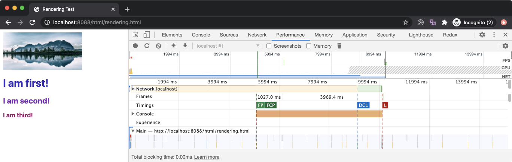

在上面的例子中，`rendering.html`文件在`head`部分有一个外部样式表，需要5秒左右的时间来下载。由于它在`head`部分，`FP`和`FCP`在5秒后发生，因为样式表会阻止它下面的任何内容的渲染（*因为它阻止CRP*）。

在这之后，我们有一个`img`元素，它加载了一张图片，大约需要10秒钟的时间来下载。因此，浏览器会在后台不断下载这个文件，并继续进行DOM解析和渲染（*因为外部图像资源既不会阻塞解析器，也不会阻塞渲染*）。

接下来，我们有三个外部的JavaScript文件，它们分别需要3s、6s和9s的时间来下载，最重要的是，它们不是`同步`的。这意味着总的加载时间应该接近**18秒**，因为在执行前一个脚本之前，后面的脚本不会开始下载。然而，看一下`DCL`事件，我们的浏览器似乎使用了**推测的策略(speculative strategy)**，急切地下载脚本文件，所以总的加载时间接近**9秒**。

由于最后一个可以影响 `DCL`的文件是最后一个脚本文件，加载时间为**9秒**（*由于样式表已经在5秒内下载完毕*），`DCL`事件发生在**9.1秒**左右。

我们还有另一个外部资源，就是图片文件，它在后台一直在加载。一旦它被完全下载（*需要10秒*），窗口的`load`事件在**10.2**秒后被触发，这标志着网页（*应用程序*）已经完全加载。