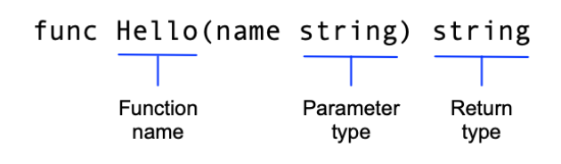

# 创建一个Go模块

这是此教程第一次介绍Go语言的一些基础特色。如果你刚开始学Go，确保你看过了 [起步](https://golang.org/doc/tutorial/getting-started.html) 教程，它介绍了go命令，go 模块 和 很简单的Go代码。

在本教程中，你将创建两个模块。第一个是一个库，它将被其他库或应用程序导入。第二个是一个调用程序，它将使用第一个模块。

本教程的序列包括六个简短的主题，每个主题说明了语言的不同部分。

1. 创建一个模块——编写一个小模块，里面的功能可以从另一个模块调用。
2.  [从另一个模块调用你的代码](https://golang.org/doc/tutorial/call-module-code.html) ——导入并使用你的新模块。
3. [返回和处理错误](https://golang.org/doc/tutorial/handle-errors.html) —— 增加简单的错误处理。
4. [返回一个随机的问候语](https://golang.org/doc/tutorial/random-greeting.html) —— 处理切片中的数据（Go的动态大小数组）。
5. [返回多人的问候](https://golang.org/doc/tutorial/greetings-multiple-people.html) ——在Map中存储键/值对。
6. [添加一个测试](https://golang.org/doc/tutorial/add-a-test.html) ——使用Go内置的单元测试功能来测试你的代码。
7. [编译和安装应用程序](https://golang.org/doc/tutorial/compile-install.html) ——在本地编译和安装你的代码。

**Note:** For other tutorials, see [Tutorials](https://golang.org/doc/tutorial/index.html).

## Prerequisites

- **一些编程经验.** The code here is pretty simple, but it helps to know something about functions, loops, and arrays.
- **一个代码编辑工具.** Any text editor you have will work fine. Most text editors have good support for Go. The most popular are VSCode (free), GoLand (paid), and Vim (free).
- **一个命令行终端.** Go works well using any terminal on Linux and Mac, and on PowerShell or cmd in Windows.

## 开始编写一个其他人可以使用的模块

首先创建一个[Go模块](https://golang.org/doc/code.html#Organization)。在一个模块中，你为一组离散而有用的功能收集成为一个或多个相关的包。例如，你可以创建一个模块，其中包含有做财务分析的功能的包，以便其他编写财务应用程序的人可以使用你的模块。

Go代码组成包，包组成模块。包的模块指定了Go运行代码的上下文，包括Go代码的版本 和 它需要的其他模块。

当您在模块中添加或改进功能时，您会发布模块的新版本。开发人员在编写调用模块功能的代码时，可以导入模块的更新包，并在投入生产使用前用新版本进行测试。

1. Open a command prompt and `cd` to your home directory.

   On Linux or Mac:

   ```
   cd
   ```

   On Windows:

   ```
   cd %HOMEPATH%
   ```

2. 创建`greetings`目录用于存放Go模块源代码。在此编写你的模块代码:

   ```
   mkdir greetings
   cd greetings
   ```
   
3. 使用[`go mod init` command](https://golang.org/cmd/go/#hdr-Initialize_new_module_in_current_directory)创建一个`go.mod` 文件开始你的模块。

   运行 `go mod init`命令，给出你的代码所在模块的路径。这里，模块路径使用`example.com/greetings`——在生产代码中，这将是下载模块的URL。

   ```bash
$ go mod init example.com/greetings
   go: creating new go.mod: module example.com/greetings
   ```
   
   `go mod init`命令创建了一个`go.mod`文件，它将你的代码标识为一个可能被其他代码使用的模块。你刚刚创建的文件只包括你的模块名称和你的代码所支持的Go版本。但是当你添加依赖关系时 -- 意味着来自其他模块的包 -- `go.mod`文件将列出要使用的特定模块版本。这样可以保持构建的可重复性，并让你直接控制要使用的模块版本。

4. 在你的文本编辑器中，创建一个文件来编写你的代码，并将其称为`greetings.go`。

5. 将以下代码粘贴到你的`greetings.go`文件中并保存文件。

   ```go
   package greetings
   
   import "fmt"
   
   // Hello returns a greeting for the named person.
   func Hello(name string) string {
       // Return a greeting that embeds the name in a message.
       message := fmt.Sprintf("Hi, %v. Welcome!", name)
       return message
   }
   ```

   这是你模块的第一段代码。它向任何要求调用的调用者返回一个问候语。你将在下一步编写调用这个函数的代码。

   在上面的代码中，你:

   - 声明了一个 `greetings` 包来收集相关功能.

   - 实现了一个 `Hello` 函数，返回问候语.

     这个函数接受一个类型为 "string "的 "name "参数，并返回一个 "string"。在Go中，一个名字以大写字母开头的函数可以被不在同一个包中的函数调用。这在Go中被称为[*exported* name](https://tour.golang.org/basics/3)。

     > **如果一个函数的函数名以大写字母开头，那么该函数会被导出。**

     

   - 声明一个`message`变量来保存你的问候语。

     在Go中，`:=`操作符是在一行中**声明和初始化**一个变量的快捷方式（Go使用右边的值来确定变量的类型）。从长计议，你可能会写成这样:
   
     ```go
     var message string
     message = fmt.Sprintf("Hi, %v. Welcome!", name)
     ```

   - 使用`fmt`包中的[`Sprintf`函数](https://pkg.go.dev/fmt/#Sprintf)来创建一个问候信息。第一个参数是一个格式字符串，`Sprintf`将`name`参数的值替换为`%v`格式动词。插入`name`参数的值就完成了问候文字。
   
   - 将格式化的问候文字返回给调用者。

### 小结

- `go mod init` 命令：以当前目录为根目录创建一个模块。 此命令会创建有一个 `go.mod`文件，其中列出的了此模块中依赖的其他模块
- 如果一个函数的函数名以大写字母开头，那么该函数会被导出，可以被其他模块调用。
- `:=`  声明并初始化
- `fmt`格式化字符串——`%v`可以将替换字符串

## 从其他模块调用你的代码

 在[上一节](https://golang.org/doc/tutorial/create-module.html)中，你创建了一个 "问候 "模块。在本节中，你将编写代码，以使你可以作为应用程序执行，并调用问候模块中的代码。

**注：**本主题是多部分教程的一部分，从[创建Go模块](https://golang.org/doc/tutorial/create-module.html)开始。

1. 在Go模块源码目中创建一个`hello`目录。在这里写你的调用者。

   例如，如果你在命令提示符中的当前目录是问候语目录，你可以使用以下命令。

   ```bash
   cd ..
   mkdir hello
   cd hello
   ```

2. 在你的文本编辑器中(在hello目录下)，创建一个文件来写你的代码，并把它叫做`hello.go`。

3. 编写代码调用`Hello`函数，然后打印函数的返回值。

   将以下代码复制到` hello.go` 中:

   ```go
   package main
   
   import (
       "fmt"
   
       "example.com/greetings"
   )
   
   func main() {
       // Get a greeting message and print it.
       message := greetings.Hello("Gladys")
       fmt.Println(message)
   }
   ```

   在此代码中，你:

   - 声明了一个 `main` 包. 在Go中，作为应用程序执行的代码必须放在主包中。.
   - 导入两个包。`example.com/greetings`和`fmt`。这样你的代码就可以访问这些包中的函数。导入`example.com/greetings`(你之前创建的模块中包含的包)使你可以访问`Hello`函数。你还可以导入`fmt`，其中有处理输入和输出文本的函数（如向控制台打印文本）。
   - 通过调用 `greetings`包的`Hello`函数来获取问候语。

4. 为这个hello包创建一个新模块。.

   在hello目录下的命令行中，运行`go mod init`命令，给它一个你的代码将在其中的模块名称(这里，只需使用 "hello")。

   ```bash
   $ go mod init example.com/hello
   go: creating new go.mod: module example.com/hello
   ```

5. 编辑`hello`模块，使用未发布的greetings模块。.

   对于生产使用，你会把你的模块发布在服务器上，无论是在公司内部还是在互联网上，Go命令将从那里下载它们。现在，你需要调整调用者的模块，使它能在你的本地文件系统中找到greetings代码。

   要做到这一点，对`hello`模块的go.mod文件做一个小小的改动。

   1. 在hello目录下，打开go.mod文件，把它改成下面的样子，然后保存文件。

      ```go
      module example.com/hello
      
      go 1.16
      
      replace example.com/greetings => ../greetings
      ```

      **这里，[replace`指令`](https://golang.org/ref/mod#tmp_15)告诉Go用你指定的路径替换模块路径(URL`example.com/greetings`)。在本例中，就是hello目录旁边的greetings目录。**

      > 或利用  [`go mod edit` command](https://golang.org/ref/mod#go-mod-edit)  将Go tools 从其模块路径重定向到本地目录
      >
      > ```bash
      > $ go mod edit -replace example.com/greetings=../greetings
      > ```

      1. 在hello目录下，运行[go mod tidy](https://golang.org/ref/mod#go-mod-tidy)命令来同步 `example.com/hello`模块的依赖，使Go找到该模块，并将其作为依赖项添加到`go.mod`文件中。

      ```bash
      $ go mod tidy
      go: found example.com/greetings in example.com/greetings v0.0.0-00010101000000-000000000000
      ```

   3. 再看go.mod，可以看到`go mod tidy`所做的改动，包括Go添加的`require`指令。

      ```
      module example.com/hello
      
      go 1.16
      
      replace example.com/greetings => ../greetings
      
      require example.com/greetings v0.0.0-00010101000000-000000000000
      ```

      为了构建该模块，Go在./greetings目录下找到了本地代码，然后添加了一个[`require`指令](https://golang.org/ref/mod#tmp_13)来指定`hello`依赖(需要)`example.com/greetings`。当你在hello.go中导入 "greetings "包（包含在greetings模块中）时，你创建了这个依赖关系。`replace`指令告诉Go在哪里可以找到`greetings`模块，因为它还没有发布。

      要引用一个已发布的模块，`go.mod`文件将省略 `replace`指令，而使用`require`指令，并在末尾标注版本号。

      ```go
      require example.com/greetings v1.1.0
      ```

6. 在hello目录下，运行代码，以确定其是否能工作

   ```go
   $ ./hello
   Hi, Gladys. Welcome!
   ```

恭喜你！你已经写了两个功能模块。在教程的[下一个主题](https://golang.org/doc/tutorial/handle-errors.html)中，你将添加一些错误处理。

### 小结

- `import`可以导入多个包，其一般形式为：

  ```go
  import (
   	"example.com/greetings"
  )
  ```

- `replace`命令可以将模块路径替换为指定的路径，这样就可以引用本地模块了。其一般形如下:

  ```go
  replace example.com/greetings => ../greetings
  ```

- `go mod tidy`命令可以同步`go.mod`文件中的依赖

## 返回并处理错误

处理错误是健壮代码的一个基本特征。在本节中，你将添加一点代码，从greetings模块返回一个错误，然后在调用者中处理它。

1. 在`greetings/greetings.go`中，添加以下代码。

   如果不知道要问候谁，发回问候就没有意义了。如果名字是空的，就返回一个错误给调用者。将下面的代码复制到`greetings.go`中并保存文件。

   ```go
   package greetings
   
   import (
       "errors"
       "fmt"
   )
   
   // Hello returns a greeting for the named person.
   func Hello(name string) (string, error) {
       // If no name was given, return an error with a message.
       if name == "" {
           return "", errors.New("empty name")
       }
   
       // If a name was received, return a value that embeds the name 
       // in a greeting message.
       message := fmt.Sprintf("Hi, %v. Welcome!", name)
       return message, nil
   }
   ```

   在此代码中，你:

   - 修改函数，使其返回两个值：一个`string`和一个`error`。你的调用者将检查第二个值，看看是否发生了错误。(任何Go函数都可以[返回多个值](https://golang.org/doc/effective_go.html#multiple-returns)。)
   - 导入Go标准库`errors`包，这样你就可以使用它的[`errors.New`函数](https://golang.org/pkg/errors/#example_New)。
   - 添加一个`if`语句来检查是否有无效的请求(名称应该是一个空字符串)，如果请求无效则返回一个错误。`errors.New`函数返回一个`error`，里面有你的信息。
   - 在成功返回中加入`nil`（意为没有错误）作为第二个值。这样，调用者就可以看到函数成功了。

2. 在你的`hello/hello.go`文件中，处理现在由`Hello`函数返回的错误，以及非错误值。

   将以下代码粘贴到`hello.go`中。

   ```go
   package main
   
   import (
       "fmt"
       "log"
   
       "example.com/greetings"
   )
   
   func main() {
       // Set properties of the predefined Logger, including
       // the log entry prefix and a flag to disable printing
       // the time, source file, and line number.
       log.SetPrefix("greetings: ")
       log.SetFlags(0)
   
       // Request a greeting message.
       message, err := greetings.Hello("")
       // If an error was returned, print it to the console and
       // exit the program.
       if err != nil {
           log.Fatal(err)
       }
   
       // If no error was returned, print the returned message
       // to the console.
       fmt.Println(message)
   }
   ```

   在此代码中，你:

   - 配置[`log`包](https://golang.org/pkg/log/)在其日志消息的开头打印命令名("greetings：")，不含时间戳或源文件信息。
   - 将包括 "error "在内的两个 "Hello "返回值分配给变量。
   - 将`Hello`参数中Gladys的名字改为空字符串，这样你就可以尝试一下你的错误处理代码。
   - 寻找一个非零的`error`值。在这种情况下继续下去是没有意义的。
   - 使用标准库的`log包`中的函数来输出错误信息。如果你得到一个错误，你使用`log`包的[`Fatal`函数](https://pkg.go.dev/log?tab=doc#Fatal)来打印错误并**停止程序**。

3. 在hello目录下的命令行，运行`hello.go`来确认代码是否有效。

   现在你传入的是一个空名字，你会得到一个错误。

   ```bash
   $ go run .
   greetings: empty name
   exit status 1
   ```

这基本上是Go中错误处理的工作方式。把一个错误作为一个值返回，这样调用者就可以检查它。这很简单。在本教程的[下一主题](https://golang.org/doc/tutorial/random-greeting.html)中，你将使用Go切片来返回一个随机选择的问候语。

### 小结

- 如何返回错误： 在方法的返回值中返回错误 

  ```go
  func Hello(name string) (string, error) {}
  ```

- 错误定义在`errors`包中，创建一个error可以使用 `errors.New("empty name")`

- 如何处理错误，一般形式为:

  ```go
  if err != nil {
      log.Fatal(err)
  }
  ```

## 返回一个随机问候语

在本节中，您将修改您的代码，使其不再每次返回一个单一的问候语，而是返回几个预定义的问候语中的一个。

要做到这一点，你将使用一个Go slice。一个 [*slice*](https://blog.golang.org/slices-intro) 就像一个数组，只不过它的大小是随着你添加和删除项目而动态调整的。它是 Go 中最有用的类型之一。您将添加一个小片来包含三条问候信息，然后让您的代码随机返回其中一条信息。

1. 在`greetings/greetings.go`中，修改你的代码，使其看起来像下面这样。

   ```go
   package greetings
   
   import (
       "errors"
       "fmt"
       "math/rand"
       "time"
   )
   
   // Hello returns a greeting for the named person.
   func Hello(name string) (string, error) {
       // If no name was given, return an error with a message.
       if name == "" {
           return name, errors.New("empty name")
       }
       // Create a message using a random format.
       message := fmt.Sprintf(randomFormat(), name)
       return message, nil
   }
   
   // init sets initial values for variables used in the function.
   func init() {
       rand.Seed(time.Now().UnixNano())
   }
   
   // randomFormat returns one of a set of greeting messages. The returned
   // message is selected at random.
   func randomFormat() string {
       // A slice of message formats.
       formats := []string{
           "Hi, %v. Welcome!",
           "Great to see you, %v!",
           "Hail, %v! Well met!",
       }
   
       // Return a randomly selected message format by specifying
       // a random index for the slice of formats.
       return formats[rand.Intn(len(formats))]
   }
   ```

   在此代码中，你:

   - 增加一个`randomFormat`函数，为问候信息返回一个随机选择的格式。请注意，**`randomFormat`以小写字母开头，使得它只能被自己包中的代码访问（换句话说，它不能被导出）。**
   - 在`randomFormat`中，声明一个`formats`分片，有三种消息格式。当声明一个分片时，你在括号中省略它的大小，像这样。`[]string`. 这告诉Go，分片的底层数组可以动态调整大小。
   - 使用[`math/rand`包](https://golang.org/pkg/math/rand/)生成一个随机数，用于从切片中选择一个项目。
   - 增加一个[`init`函数](https://golang.org/doc/effective_go.html#init)，为`rand`包添加当前时间的种子。**在全局变量初始化后，Go会在程序启动时自动执行`init`函数。**
   - 在 `Hello`中，调用`randomFormat`函数来获取你要返回的消息的格式，然后使用格式和 `name `值一起创建消息。
   - 像之前那样返回信息（或错误）。

2. 在`hello/hello.go`中，将其中代码更改为以下内容

   ```go
   package main
   
   import (
       "fmt"
       "log"
   
       "example.com/greetings"
   )
   
   func main() {
       // Set properties of the predefined Logger, including
       // the log entry prefix and a flag to disable printing
       // the time, source file, and line number.
       log.SetPrefix("greetings: ")
       log.SetFlags(0)
   
       // Request a greeting message.
       message, err := greetings.Hello("Gladys")
       // If an error was returned, print it to the console and
       // exit the program.
       if err != nil {
           log.Fatal(err)
       }
   
       // If no error was returned, print the returned message
       // to the console.
       fmt.Println(message)
   }
   ```

3. 在命令行，切换到hello目录下，然后运行`hello.go`，确认代码有效。多次运行，注意问候语的变化

   ```bash
   $ go run .
   Great to see you, Gladys!
   
   $ go run .
   Hi, Gladys. Welcome!
   
   $ go run .
   Hail, Gladys! Well met!
   ```

这就是对Go 分片的介绍。为了让这种类型得到更多的使用，你将使用一个分片来向多个人打招呼。这在教程的[下一主题](https://golang.org/doc/tutorial/greetings-multiple-people.html)中。

### 小结

- 以小写字母开头的方法，只能被自己包中的代码访问（换句话说，它不能被导出）

- 声明并初始化一个slice：

  ```go
  formats := []string{
      "aaa",
      "bbb",
  }
  ```

- 在全局变量初始化后，Go会在程序启动时自动执行`init`函数。

## 为多个人返回问候语

在你对模块代码的最后一次修改中，你将添加支持在一个请求中获取多人的问候。换句话说，你将处理一个多值输入和对值与多值输出。

要做到这一点，你需要向一个函数传递一组名字，该函数可以为每个名字返回一个问候语。将`Hello`函数的参数从一个名字改为一组名字会改变函数的签名。如果你已经发布了`greetings`模块，而用户已经编写了调用`Hello`的代码，这种改变会破坏他们的程序。在这种情况下，更好的选择是给新功能起一个新的名字。

在本教程将要添加的最后一段代码中，更新代码，就像你已经发布了一个 `greetings`模块的版本一样。不要改变`Hello`函数，而是添加一个新的函数`Hellos`，它接受一组名字。然后，为了简单起见，让新函数调用现有函数。将这两个函数保留在包中，为现有的调用者（或未来只需要一个问候语的调用者）留下原来的函数，为想要扩展功能的调用者增加一个新函数。

1. 在greetings/greetings.go中，修改你的代码，使其看起来像下面这样。

   ```go
   package greetings
   
   import (
       "errors"
       "fmt"
       "math/rand"
       "time"
   )
   
   // Hello returns a greeting for the named person.
   func Hello(name string) (string, error) {
       // If no name was given, return an error with a message.
       if name == "" {
           return name, errors.New("empty name")
       }
       // Create a message using a random format.
       message := fmt.Sprintf(randomFormat(), name)
       return message, nil
   }
   
   // Hellos returns a map that associates each of the named people
   // with a greeting message.
   func Hellos(names []string) (map[string]string, error) {
       // A map to associate names with messages.
       messages := make(map[string]string)
       // Loop through the received slice of names, calling
       // the Hello function to get a message for each name.
       for _, name := range names {
           message, err := Hello(name)
           if err != nil {
               return nil, err
           }
           // In the map, associate the retrieved message with 
           // the name.
           messages[name] = message
       }
       return messages, nil
   }
   
   // Init sets initial values for variables used in the function.
   func init() {
       rand.Seed(time.Now().UnixNano())
   }
   
   // randomFormat returns one of a set of greeting messages. The returned
   // message is selected at random.
   func randomFormat() string {
       // A slice of message formats.
       formats := []string{
           "Hi, %v. Welcome!",
           "Great to see you, %v!",
           "Hail, %v! Well met!",
       }
   
       // Return one of the message formats selected at random.
       return formats[rand.Intn(len(formats))]
   }
   ```

   在此代码中，你:

   - 增加一个 `Hellos`函数，其参数是一个*names*的切片，而不是一个name。另外，你把它的一个返回类型从 `string`改为`map`，这样你就可以返回映射到问候信息的名字。
   - 让新的Hellos函数调用现有的Hello函数。这样，两个函数都会留在原地。
   - 创建一个`messages`[map](https://blog.golang.org/maps)，将每个接收到的名字（作为键）与生成的消息（作为值）关联起来。在Go中，你用以下语法初始化一个map。**make(map[key-type]*value-type*)**。你让`Hellos`函数把这个地图返回给调用者。
   - 循环检查你的函数收到的名称，检查每个名称是否有一个非空值，然后为每个名称关联一个消息。在这个 "for "循环中，"range "返回两个值：循环中当前项的索引和项的值的副本。你不需要索引，所以你使用Go[空白标识符（下划线）](https://golang.org/doc/effective_go.html#blank)来忽略它。

2. 在你的`hello/hello.go`调用代码中，传递一片names，然后打印你得到的`names/essages map`的内容。

   在`hello.go`中，修改你的代码，使其看起来像下面。

   ```go
   package main
   
   import (
       "fmt"
       "log"
   
       "example.com/greetings"
   )
   
   func main() {
       // Set properties of the predefined Logger, including
       // the log entry prefix and a flag to disable printing
       // the time, source file, and line number.
       log.SetPrefix("greetings: ")
       log.SetFlags(0)
   
       // A slice of names.
       names := []string{"Gladys", "Samantha", "Darrin"}
   
       // Request greeting messages for the names.
       messages, err := greetings.Hellos(names)
       if err != nil {
           log.Fatal(err)
       }
       // If no error was returned, print the returned map of
       // messages to the console.
       fmt.Println(messages)
   }
   ```

   有了这些变化，你:

   - 创建一个 "names "变量，作为一个分片类型，容纳三个名字。
   - 将`names`变量作为参数传递给`Hellos`函数。

3. 在命令行，切换到`hello/hello.go`的目录下，然后运行`hello.go`来确认代码是否有效。

   输出应该是一个将名字和消息关联起来的地图的字符串表示，就像下面这样。

   ```bash
   $ go run .
   map[Darrin:Hail, Darrin! Well met! Gladys:Hi, Gladys. Welcome! Samantha:Hail, Samantha! Well met!]
   ```

本主题介绍了表示名称/值对的Map。它还介绍了[保留向后兼容性](https://blog.golang.org/module-compatibility)的想法，即通过为模块中的新功能或改变的功能实现一个新功能。在本教程的[下一个主题](https://golang.org/doc/tutorial/add-a-test.html)中，你将使用内置功能为你的代码创建一个单元测试。

### 小结

- 定义map的一般形式

  ```go
  # map[key-type](value-type)
  map[string]string
  ```

- 创建一个map

  ```go
  make(map[key-type](value-type))
  ```

- 迭代map

  ```go
  for _,key := range somemap {
      
  }
  ```

  

## 添加一个测试

现在你已经把你的代码稳定下来了（顺便说一句，做得很好），添加一个测试。在开发过程中测试你的代码可以暴露出错误，这些错误会在你进行修改时发现。在这个主题中，你为Hello函数添加了一个测试。

Go对单元测试的内置支持使您更容易进行测试。具体来说，使用命名惯例、Go的 `testing`包和 `go test`命令，你可以快速编写和执行测试。

1. 在`greetings`目录下，创建一个名为`greetings_test.go`的文件。

   以`_test.go`作为文件名的结尾，告诉`go test`命令这个文件包含测试函数。

2. 在`greetings_test.go`中，粘贴以下代码并保存文件。

   ```go
   package greetings
   
   import (
       "testing"
       "regexp"
   )
   
   // TestHelloName calls greetings.Hello with a name, checking 
   // for a valid return value.
   func TestHelloName(t *testing.T) {
       name := "Gladys"
       want := regexp.MustCompile(`\b`+name+`\b`)
       msg, err := Hello("Gladys")
       if !want.MatchString(msg) || err != nil {
           t.Fatalf(`Hello("Gladys") = %q, %v, want match for %#q, nil`, msg, err, want)
       }
   }
   
   // TestHelloEmpty calls greetings.Hello with an empty string, 
   // checking for an error.
   func TestHelloEmpty(t *testing.T) {
       msg, err := Hello("")
       if msg != "" || err == nil {
           t.Fatalf(`Hello("") = %q, %v, want "", error`, msg, err)
       }
   }
   ```

   在此代码中，你:

   - 在与你要测试的代码相同的包中实现测试函数。
   - 创建了2个测试函数去测试`greetings.Hello`函数。测试函数名名为*Test**Name***，***Name***指定要测试的函数。测试函数接受[`testing` package's](https://golang.org/pkg/testing/) `testing.T`做为一个参数。你可以使用这个参数的方法用于测试的报告或记录日志。
   - 实现了2个测试:
     - `TestHelloName` calls the `Hello` function, passing a `name` value with which the function should be able to return a valid response message. If the call returns an error or an unexpected response message (one that doesn't include the name you passed in), you use the `t` parameter's `Fatalf` method to print a message to the console and end execution.
     - `TestHelloEmpty` calls the `Hello` function with an empty string. This test is designed to confirm that your error handling works. If the call returns a non-empty string or no error, you use the `t` parameter's [`Fatalf` method](https://golang.org/pkg/testing/#T.Fatalf) to print a message to the console and end execution.

3. 在命令行中的greetings目录中，执行`go test`命令执行测试。

   [go test](https://golang.org/cmd/go/#hdr-Test_packages)命令执行测试文件（名称以`_test.go`结尾）中的测试函数（名称以`Test`开头）。可以添加`-v`标记来查看详细输出。

   ```bash
   $ go test
   PASS
   ok      example.com/greetings   0.364s
   
   $ go test -v
      === RUN   TestHelloName
   --- PASS: TestHelloName (0.00s)
      === RUN   TestHelloEmpty
   --- PASS: TestHelloEmpty (0.00s)
      PASS
      ok      example.com/greetings   0.372s
   ```
   
4. 破话 `greetings.Hello` 函数来看以下测试失败的情况.

   ```go
   // Hello returns a greeting for the named person.
   func Hello(name string) (string, error) {
       // If no name was given, return an error with a message.
       if name == "" {
           return name, errors.New("empty name")
       }
       // Create a message using a random format.
       // message := fmt.Sprintf(randomFormat(), name)
       message := fmt.Sprint(randomFormat())
       return message, nil
   }
   ```

5. 在命令行运行， `go test`执行测试

   ```bash
   $ go test
   --- FAIL: TestHelloName (0.00s)
       greetings_test.go:15: Hello("Gladys") = "Hail, %v! Well met!", <nil>, want match for `\bGladys\b`, nil
   FAIL
   exit status 1
   FAIL    example.com/greetings   0.182s
   ```

### 小结

- 以`_test.go`作为文件名的结尾，告诉`go test`命令这个文件包含测试函数。
- 测试函数接受[`testing` package's](https://golang.org/pkg/testing/) `testing.T`做为一个参数。你可以使用这个参数的方法用于测试的报告或记录日志。

## 编译和安装应用程序

在这最后一个主题中，你将学习几个新的go命令。虽然`go run`命令是一个有用的快捷方式，当你频繁地进行修改时，它可以编译和运行一个程序，但它不会生成一个二进制的可执行文件。

本主题介绍了两个额外的指令，用于构建代码:

-  [`go build` command](https://golang.org/cmd/go/#hdr-Compile_packages_and_dependencies) : 编译包及其依赖，但是不会安装编译后的结果
- [`go install` command](https://golang.org/ref/mod#go-install) : 编译并安装包

1.在命令行中，切换到`hello`目录，运行`go build`命令，将代码编译为可执行的二进制文件

```bash
$ go build
```

2.在命令行中，切换到`hello`目录,运行编译生成的`hello`命令，确认代码工作正常

注意，编译后的结果取决于你的系统:

- 在Linux 或 Mac上

  ```bash
  $ ./hello
  map[Darrin:Great to see you, Darrin! Gladys:Hail, Gladys! Well met! Samantha:Hail, Samantha! Well met!]
  ```

- 在Window上

  ```bash
  $ hello.exe
  map[Darrin:Great to see you, Darrin! Gladys:Hail, Gladys! Well met! Samantha:Hail, Samantha! Well met!]
  ```

你已经将应用编译成了可执行文件。但是要正确运行该文件，你要么需要在正确的目录中运行该文件，要么需要指定可执行文件的路径。

接下来，你会安装可执行文件，这样不用指定文件的路径就能够运行该文件了。

3. 找到Go安装路径，go 命令会将当前包安装在此路径下

   可以运行[`go list` command](https://golang.org/cmd/go/#hdr-List_packages_or_modules) 命令查询Go的安装路径

   ```bash
   $ go list -f '{{.Target}}'
   ```

   例如，命令行可能输出 `/home/gopher/bin/hello`, 这意味着二进制文件会被安装到 ` /home/gopher/bin`中。下一步汇总会用到此目录

4. 将Go安装目录添加到系统的shell目录中

这样，你就可以运行可执行程序而不用指定可执行程序的位置。

- 在Linux 或 Mac,运行以下命令: 

  ```bash
  export PATH=$PATH:/path/to/your/install/directory
  ```

- 在Windows上，运行以下命令:

  ```bash
  set PATH=%PATH%;C:\path\to\your\install\directory
  ```

最为一种替代方案，你已经有一个像`$HOME/bin`这样的目录在shell路径中，你想安装Go程序到此路径，你可以使用[`go env` 命令](https://golang.org/cmd/go/#hdr-Print_Go_environment_information)通过设置GOBIN变量改变安装目标。

```bash
go env -w GOBIN=/path/to/your/bin
```

或

```bash
go env -w GOBIN=C:\path\to\your\bin
```

5. 一旦你已经更新了shell 路径，运行`go install`命令去编译并安装包:

```bash
$ go install
```

6. 简单地输入名称即可运行你的程序

```bash
$ hello
map[Darrin:Hail, Darrin! Well met! Gladys:Great to see you, Gladys! Samantha:Hail, Samantha! Well met!]
```

### 小结

-  [`go build` command](https://golang.org/cmd/go/#hdr-Compile_packages_and_dependencies) : 编译包及其依赖，但是不会安装编译后的结果
- [`go install` command](https://golang.org/ref/mod#go-install) : 编译并安装包

## 参考

[Tutorial: Create a Go module](https://golang.org/doc/tutorial/create-module)

