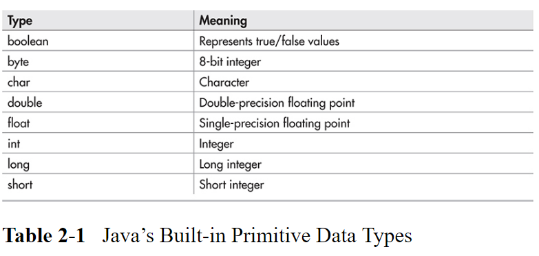
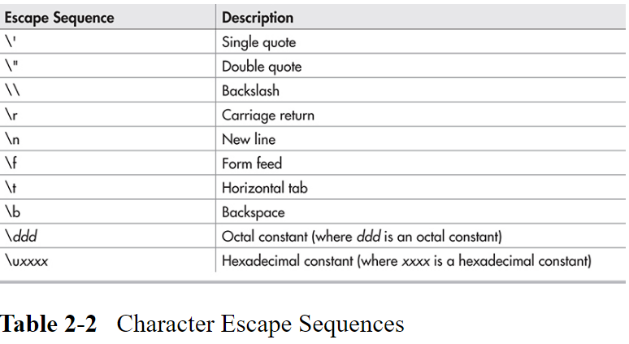
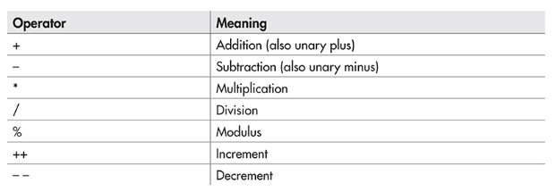
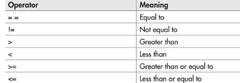
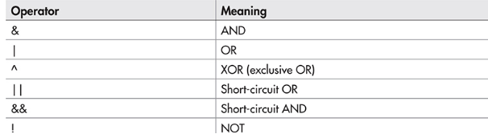
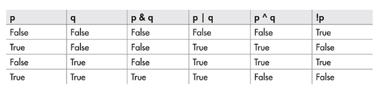

---
---

# 2 数据类型和运算符

[[toc]]

## 数据类型

### 为什么数据类型如此重要

数据类型在Java中尤其重要，因为Java是强类型语言。这意味着，编译器会对所有的运算符进行检查，检查类型是否兼容。非法运算符不会被编译。因此，为了进行强类型检查，所有的变量、表达式和值都要有类型。此外，一个值的类型决定了可以对它运用哪些运算符。

### Java原始数据类型

Java内置的数据类型可以分为两类：

- 基于对象的类型（object-oriented）: 通过类定义
- 非基于对象的类型（non-object-oriented）

原始（primitive）的意思是，这些类型不是基于对象的，而是普通的二进制值。这些原始类型不是对象，是从效率方面考虑的。所有的其他Java类型都是基于这些原始类型构造的。



Java对每一个原始类型都严格规定了范围，所有的Java虚拟机都必须支持，没有商量的余地，这也是从跨平台角度考虑的。

#### 整型


所有的整型都是有符号的。Java不支持无符号(只有正数)整型。

#### 浮点型

- float: 32bits
- double: 64bits

#### 字符型（Characters)

在Java中，字符型不像其他语言中用8bits表示。相反，Java使用Unicode。Unicode定义的字符集可以表示人类所有的可读文字。在Java中，**char**是一个无符号16bit类型，其范围为 0-65535 。标准的8bit的 ASCII字符集是Unicode的一个子集。

> ##### 为什么Java要使用Unicode?
>
> Java设计用于世界范围内使用。因此需要使用一个能够表示全世界范围内的语言的字符集。
>
> Unicode字符集就是被设计用来干这个的。

#### 布尔型

- true
- false

### 字面量(Literals)

在Java中，字面量也叫常量(constants)。字面量可以是任意的原始数据类型。每个字面量的类型取决于其数据的类型。如: 10 、-100是整型，默认情况下，整型字面量的类型是int。如果要指定一个long类型的字面量，需要添加一个l 或 L . 如 字面量 12L 的类型为 long。

默认情况下，浮点型字面量的类型的 double。制定float类型的字面量需要添加一个f或F。

#### 十六进制、8进制和二进制字面量

十六进制字面量，以0x或0X开头。 如 0xFF = 255

八进制字面量，以0开头。如 011 = 9.

二进制字面量，以0b或0B开头。如 0b1100 =  12.

### 字符转义



### 字符串字面量

字符串字面量用双引号包起来。字符字面量用单引号包起来。

字符串 与 字符是不同的类型，不要弄混。

### 变量深入

你可以声明任意合法类型的变量，每个变量都有一个类型。因此，一个变量的能力取决于其类型。

例如，一个 boolean 类型的变量不能用来存储浮点数。此外，变量的类型在其声明周期内不能够修改。例如，一个int类型的变量不能转换为 char 变量。

Java中所有变量必须在声明后才能使用。因为编译器在编译之前必须知道数据的类型是什么。

#### 初始化一个变量

通常，在使用一个变量之前需要先给它赋一个值。一种赋值方式是使用赋值语句。另一种方式是在变量声明时给它一个初始值。语法如下:

```
type var = value;
```

value 就是为 var 变量赋的初始值。

同时为多个变量赋值:

```java
int a, b = 8 , c = 9 , d;
```

#### 动态初始化

例子:

```java
class DynInit {
    public static void main(String[] args){
        double radius = 4,height = 5;
        
        double volume = 3.1416 * radis * radis * height;
        
        System.out.println("Volume is " + volume);
    }
}
```

`double volume = 3.1416 * radis * radis * height;` 在运行时初始化，这就是动态初始化。

这里的关键是，在这里的初始化表达式可以是任何合法的表达式，包括 调用一个方法、其他变量 或 字面量。

#### 变量作用范围和生命周期

Java允许变量在任意代码块（一对花括号）中声明。一个代码块是一个作用域（scope)。因此，每创建一个代码块，就创建了一个新的作用域。域决定了哪些变量对程序的其他部分是否可见，也决定了这些变量的生命周期。

通常，Java中的每个变量都有一个作用域。Java中有两个常见的作用域，一个是由类定义的作用域，另一个是由方法定义的域。类定义的作用域放到后面讨论。现在讨论一下由方法定义的作用域。

方法定义的作用域由开口花括号开始，由闭口花括号结束，如果方法有参数，它们也会被包含进方法的作用域中。这个代码块叫做 *方法体（method body）*。

一般来说，在一个作用域中声明的变量对于域外的代码不可见。因此，当你在一个作用域中定义一个变量，就将其本地化了，并保护该变量不被访问或修改。事实上，作用域规则为封装提供了基础。在一个代码块中定义的变量叫做 *局部变量(local variable)*.

作用域可以嵌套。例如，可以在代码块中嵌套代码块。外部代码块中的对象对于内部代码块是可见的，反之则不成立。

在一个代码块中，变量可以在任何地方声明，但只有在变量声明后才是合法的。即，先声明，后使用。

另一个关键点是，在进入变量所在的作用域时，变量就被创建了；在离开变量所在的作用域后，变量就被销毁。因此，在一个方法中声明的变量，不会在方法调用之间保持其值。另外，在一个作用域中声明的变量在离开该作用域时将失去其值。因此，一个变量的寿命只限于它的作用域。

如果一个变量在声明时进行了初始化，那么这个变量在每次进入其所在的作用域时都会重新初始化。

Java作用域规则有一个古怪的地方，就是：尽管代码块可以嵌套，但是在内层作用域中声明的变量不能与外层作用域所声明的变量有相同的名称。

## 运算符

Java有四种类型的运算符:

### 数学运算符



这些运算符可用于内置的数字类型，也可以用于 **char**类型。

有几个特殊情况值得一提:

1.  当 / 用于一个整数时，余数会被截断。10 / 3 = 3。
2.  % 可以用于整数 和 浮点数 。 因此 10.0 % 3.0  = 1.

#### 自增和自减

##### 自增

```java
x++;
```

相当于:

```java
x = x + 1;
```

##### 自减

```java
x--;
```

相当于

```java
x = x - 1;
```

##### 前置++ 和 后置 ++ 的区别

当 ++ 最为一个表达式的一部分时，前置 ++ 和后置 ++ 是有区别的。对于前置 ++ ，会先计算++的值，再计算表达式。对于后置++，会先计算表达式的值，然后再计算++的值。

前置++例子：

```java
x = 10;
y = ++x;
// y = 11
// x = 11
```

后置++ 例子:

```java
x = 10;
y = x++;
// y = 10
// x = 11;
```

### 位运算符

### 关系运算符  



关系运算符输出的结果是 **boolean** 值。在Java中，所有的对象比较是否相等都可以用 == 和 != 。然而，比较运算符 < , > , <=  或 >= 只能用于有顺序关系的对象。因此，所有的关系运算符都可以用于数值型和 char类型变量。而布尔类型的变量只能比较相等或不相等，因为 true 和 false 没有顺序关系。例如， true > false 在Java中没有意义。

### 逻辑运算符



逻辑运算符输出的结果是 **boolean** 值。逻辑运算符的操作数是布尔类型，结果也是布尔类型。



#### 短路逻辑运算符

Java支持短路版本的 AND 和 OR 逻辑运算符，用来编写更高效的代码。

在AND运算符中，如果第一个操作数是false,那么结果就是false，没有必要计算第二个操作数。在OR 运算符中，如果第一个操作数为true，那么结果就是true，没有必要计算第二个操作数。因此这两种情况下，如果不计算第二个操作数，可以节省时间。