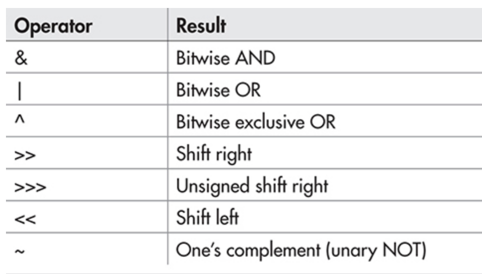
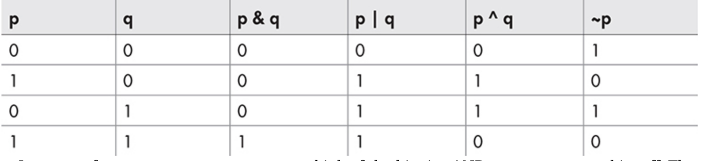
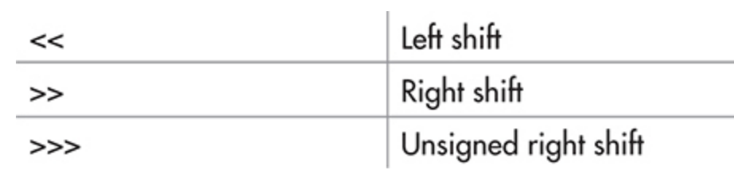

# 5 更多的数据类型和运算符

[[toc]]

## 数组

数组是相同类型的变量的集合。Java中数组可以是一维或多维的。

数组主要的优势是，按照这种方式组织的数据很容易操作。如计算均值，排序等。

尽管Java中的数组可以像其他编程语言中的数组一样使用，但它们有一个特殊的属性：它们被实现为对象。通过将数组实现为对象，可以获得几个重要优势，其中最重要的是，未使用的数组可以被垃圾回收。

### 一维数组

```
type array-name[ ] = new type[size]; 
type array-name[ ] = { val1, val2, val3, ... , valN }; // 初始化数组元素
```

### 多维数组

一个多维数组是 数组的数组。

```java
int table[][] = new int[10][20];
// 一般形式
type name[ ][ ]...[ ] = new type[size1][size2]...[sizeN];
```

### 其他定义语法

```
type[ ] var-name;
```

### 赋值数组引用

数组是一个对象，因此将一个数组变量复制给另一个变量时，是引用传递，并没有生成新的数组。

### length属性

数组是一个对象，其有一个属性为 length，可以获取当前数组中元素的个数。

### For-Each风格的for循环

for-each循环用来迭代对象的集合，如数组，严格按顺序进行，从开始到结束。在JDK5中，支持for-each功能。

```
for(type itr-var : collection) statement-block
```

for-each会自动执行循环。具体说，它不需要循计数器，不需要指定开始和结束值，不需要建立索引。相反，它会自动迭代整个数组，按顺序从头到尾，一次获取一个元素，

尽管for-each会迭代数组中所有的元素，但仍然可以使用break语句来提前终止for-each循环。

```java
for(int x : nums){
    System.out.println("Value si :" + x);
    sum += x;
    if (x == 5) break; // 在x=5时结束循环
}
```

这里有一个理解for-each循环的关键。它的迭代变量是“只读”的，应为它与底层数组有关。给迭代变量赋值不会影响底层数组。换句话说，无法通过给迭代变量复制来改变数组的内容。举例如下:

```java
int nums[] = {1,2,3,4,5,6,7,8,9,10};
for(int x : nums){
    System.out.println(x + " ");
    x = x * 10; // 对于nums没有影响，不会改变nums
}

System.out.println();

for(int x : nums)
    System.out.println(x + " ");

System.out.println();
```

结果为:

```
1 2 3 4 5 6 7 8 9 10
1 2 3 4 5 6 7 8 9 10
```

## 字符串

在某些语言中，字符串是字符数组。而在Java中，字符串是对象。

### 创建字符串

像创建对象一样创建一个字符串:

```java
String str = new String("hello");
```

字面量方式:

```java
String str = "hello";
```

### 字符串操作

- boolean equals(str): 判断两个字符串包含的字符序列是否相同
- int length(): 返回字符串的长度
- char charAt(index): 返回字符串在index处的字符。
- int compareTo(str): 比较两个字符串的大小。返回值等于0，一样大；大于0，调用者大；小于0，调用者小。
- int indexOf(str): 返回str在调用者中第一次出现的位置，没找到返回-1.
- int lastIndexOf(Str): 返回str在调用者中最后一次出现的位置，没找到返回-1.

> Q: 为何String要定义equals()方法，而不用 == ？
>
> A: equals()方法比较两个字符串的字符序列是否相等。== 比较它们是否引用的是同一个对象。

### 字符串是不可变的

字符串的内容是不可变的。即，一旦字符串被创建，组成字符串的字符序列就不能被修改。这个限制让Java能够更高效的实现字符串。这听起来像是缺点，但其实不是。当想要已经存在的字符变化时，只需要创建新的字符串即可。因为未使用的字符串会被自动回收。然而，必须明确的是，字符串引用变量当然可以改变它们所指向的对象。只是一个特定的字符串对象的内容在它被创建后不能被改变。

>Q: 如何创建一个可变的字符串
>
>A: 使用StringBuffer 或 StringBuilder。 它们创建的字符串可以改变。

## 局部变量类型推断

回顾一下Java变量中两个重点:

- 所有变量必须先声明，后使用
- 变量可以在声明时被初始化

此外，变量初始化时，其初始化值的类型与变量类型要一致，或能够转换为变量的类型。因此，原则上来说，没有必要为被初始化的变量显示地指定类型，因为其类型可以通过其初始化的值推断出来。当然，在过去，Java不支持这种类型推断，且所有变量，无论它们是否被初始化，都需要显示地声明类型。现在，时代变了。

从JDK10开始，能够让编译器基于初始化值的类型来推断局部变量的类型，因此不必显示地声明变量的类型了。局部变量类型推断带来了很多优点。如，不用冗余地指定变量的类型，而使代码更加精简。在类型很长时，可以简化声明。当某种类型难以辨别或无法表示时，它也会有所帮助（不能被表示的类型的一个例子是匿名类的类型，在第16章中讨论）。此外，局部变量类型推理已经成为当代编程环境的一个常见部分。将其纳入Java有助于使Java与语言设计中不断发展的趋势保持一致。为了支持局部变量类型推断，上下文敏感的标识符var被添加到Java中，作为一个保留的类型名称。

要使用局部变量的类型推断，**变量必须以var作为类型名来声明，并且必须包括一个初始化器**。考虑下面的语句，它声明了一个名为avg的局部双变量，它的初始化值为10.0。

```java
double avg = 10.0;
```

使用类型推理，这个声明也可以这样写:

```java
var avg = 10.0;
```

在这两种情况下，avg的类型都是double。在第一种情况下，它的类型是明确指定的。在第二种情况下，它的类型被推断为double，因为初始化器10.0的类型是double。

如前所述，var是作为一个上下文敏感的标识符而添加的。当它在局部变量声明的上下文中被用作类型名时，它告诉编译器使用类型推理，根据初始化器的类型来确定被声明变量的类型。因此，在局部变量声明中，var是一个实际推断类型的占位符。然而，当在大多数其他地方使用时，var只是一个用户定义的标识符，没有特殊的含义。例如，下面的声明仍然有效:

```java
int var = 1; // var 只是一个简单的用户自定义的标识符
```

再强调一下:

- 在用var声明变量时，必须要进行初始化
- var只能用于局部变量。例如，不能用于声明实例变量、参数或返回值。

### 引用类型的局部变量推断

对于引用类型也可以使用局部变量推断。

```java
var fin = new FileInputStream("test.txt");
```

### 在for循环中使用局部变量类型推断

```java
for(var v : nums){
    System.out.println(v + " ");
}
```

### var的一些限制

- 一次只能声明一个var变量

- var变量不能使用null作为初始值

- var变量不能使用表达式来进行初始化

- 尽管能使用var来声明数组类型，但不能使用数组来初始化var变量

  ```java
  var myArray = new int[10]; // valid
  var myArray = {1,2,3}; // wrong
  ```

- var不能用于类名，也不能用于其他引用类型的名称，包括接口、枚举或注解

- 局部变量类型推理不能用于声明由catch语句捕获的异常类型。

- 另外，lambda表达式和方法引用都不能作为初始化器使用。

## 位运算符

位运算符可以用于long,int,short,char和 byte类型。不能用于 boolean,float或double，或类类型。



真值表:



### 移位操作



通常形式如下:

```
value << num-bits

value >> num-bits

value >>> num-bits
```

## ?运算符

？ 用来替换 if-else

```
Exp1 ? Exp2 : Exp3;
```

Exp1为true，执行 Exp2，否则执行Exp3.