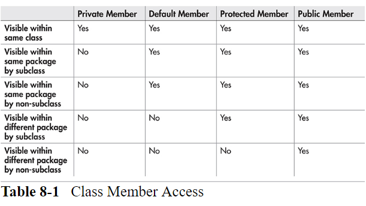
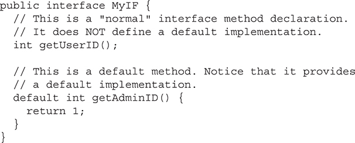

# 8 包和接口

[[toc]]

包: 将相关的类组合在一起。有助于代码组织，并提供了另一种层面的封装。

接口: 定义一些列实现类要实现的方法。指定一个类要做什么，而不是如何做。

## 包

包的两个目的:

- 一个程序的相关的部分组织在一起，形成一个单元。定义在包中的类必须通过包名才能访问。因此包提供了一种命名类的方法
- 包可以在Java的访问控制机制中起作用。在一个包内定义的类可以成为该包的私有类，而不能被包外的代码访问。

### 包和成员访问



## 接口

JDK8之前，接口中只能定义抽象方法。JDK8中，接口中可以定义默认实现方法。

JDK9中，还支持静态接口方法 和 private方法。

定义接口的一般形式:

```java
access interface name {
   ret-type method-name1(param-list);
   ret-type method-name2(param-list);
   type var1 = value;
   type var2 = value;
   // ...
   ret-type method-nameN(param-list);
   type varN = value;
}
```

接口中，方法默认修饰符是public；变量默认修饰符是 public final static，并且必须被初始化，即它们本质上是常量。


### 实现接口

实现接口的一般形式:

```java
class classname extends superclass implements interface {
   // class-body
}
```

实现接口的方法，必须要是public，应为接口中的方法默认是public的。

> 如果一个类没有完全实现接口中的方法，那么这个类必须要被定义为抽象类

### 接口中的变量

接口中变量默认修饰符是 public final static。

大部分程序中需要定义常量，其中一种方式就是使用接口来定义。但使用接口来定义常量是由争议的，这里只是说明接口可以实现此种功能。

### 接口继承

一个类要实现一个接口，必须实现该接口继承链上的所有方法。

### 默认接口方法

JDK8中，接口中可以添加默认实现的方法——default method。

默认方法出现的主要动机是:  在对一个接口进行扩展是，不会破坏已有的实现类。 如果没有默认方法，那么对一个接口进行扩展，其说有的实现类都需要实现扩展的方法，这样会破坏已有的实现类。

 默认方法的另一个动机是希望在一个接口中指定一些方法，这些方法基本上是可选的，取决于接口的使用方式

需要指出的是，增加默认方法并没有改变接口的一个关键原则：一个接口仍然不能有实例变量。因此，接口和类之间的不同是，类可以维护状态信息，而接口不行。此外，接口也不能创建实例，它只能被类实现。

#### 默认方法基础

使用关键字 default 定义



### 多继承问题

例如，一个类实现了两个个接口，如果这些接口中的每一个都提供默认方法，那么有些行为就会从这两个接口中继承。因此，在有限的范围内，默认方法确实支持行为的多重继承。那么，在这种情况下，会发生名称冲突吗？

如有两个接口，Alpha 和 Beta ，它们被MyClass类实现。如果 Alpha 和 Beta都有一个叫做 reset( ) 的默认方法，MyClass类会使用哪个接口的方法？ 或者，如果Beta继承Alpha，哪个默认方法会被使用？或者，如果MyClass自己也实现了默认方法，会怎么样？为了处理这种情况，Java定义了一些列规则来解决冲突。

首先，类实现优先于接口的默认实现。因此，如果MyClass提供了实现，那么就会使用MyClass的方法。此时，这两个接口的默认方法都被MyClass覆盖。

其次，如果一个类实现了两个有相同默认方法的接口，如果类没有覆盖此方法，那么会出错。按上面的例子，如果MyClass实现了Alpha 和 Beta接口，但是没有重写 reset()方法，那么就会报错。

如果一个接口继承另一个，它们都定义了相同的默认方法，继承的接口的默认方法的优先级较高。按上面的例子，如果Beta 继承 Alpha，那么Beta的reset()方法会被使用。

可以通过super的新的形式，来显示的访问默认实现:

```java
InterfaceName.super.methodName( )
```

例如，如果Beta想要访问Alpha的reset()方法，可以使用:

```java
Alpha.super.reset();
```

### 使用静态方法

JDK8中，可以在接口中添加一个或多个静态方法。

```java
InterfaceName.staticMethodName
```

注意，静态接口方法不会被实现类或子接口继承

### 私有方法

JDK9中，可以在接口中添加私有方法，私有方法只能被接口中的默认方法或其他私有方法调用

私有方法的主要用处是对公共代码片段进行抽取，避免重复代码。