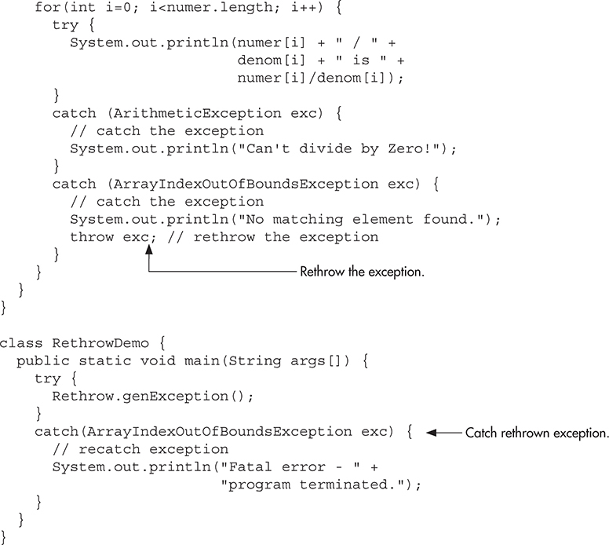
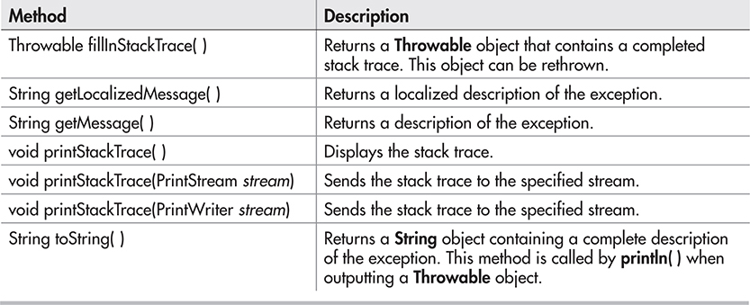
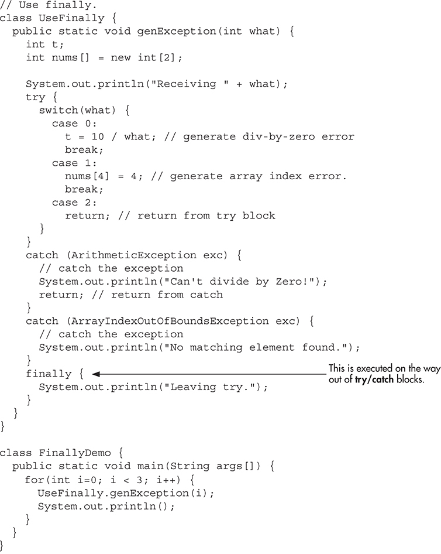
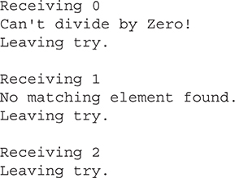
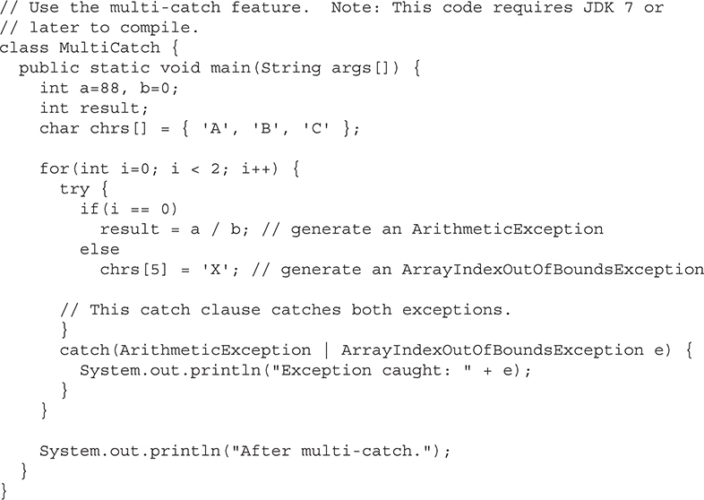
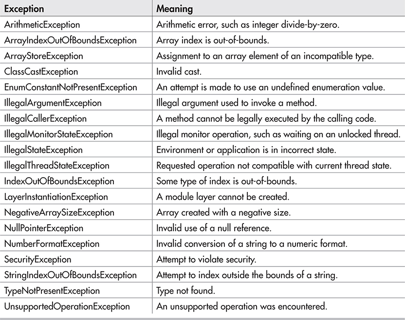
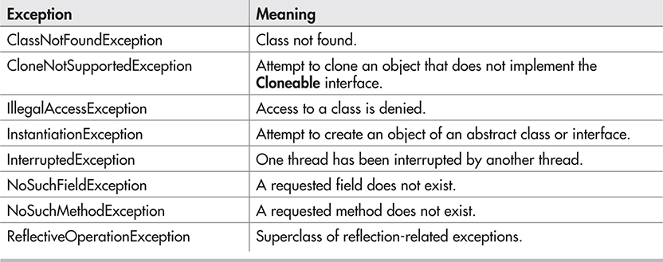

# 9 异常处理

[[toc]]

异常是运行时发生的错误。Java异常处理系统可以处理运行时异常。

## 异常层级

所有异常类派生于 Throwable。Throwable 有两个子类： Exception 和 Error。

Error是Java虚拟机中的错误，不是你的程序中的，通常不需要处理它们。

Exception是程序中的错误，通常需要处理此类错误。

Exception的一个重要的子类的 RuntimeException，它可以表示各种各样的运行时异常。

## 异常处理基础

使用try监控异常，如果try中出现异常，它会被抛出；可以使用catch来捕获异常，然后对异常进行处理。

系统产生的异常会自动被Java运行时系统抛出。如果要手动抛出异常，可以使用throw。在某些情况下，如果一个方法要抛出异常，必须通过 throws 指定 。finally 代码块中存放的是 try代码块一退出后就要执行的代码。

### 使用try catch

```java
try {
   // block of code to monitor for errors
}
catch (ExcepType1 exOb) {
   // handler for ExcepType1
}
catch (ExcepType2 exOb) {
   // handler for ExcepType2
}
```

> catch块可以有多个；捕获到哪个异常，哪个catch代码块就执行，判断顺序是从上到下依次判断的

> 注意: 还有一种形式的try语句,它支持自动资源管理，它就是: try-with-resources。这是用来管理I/O流的，之所以存在这种形式，是因为I/O资源是最常用的，具体情况后面再说。

### 没有处理异常的后果

处理异常有一个好处，就是：防止程序非正常终止。 如果一个异常抛出了，那么它必须被处理，否则它会被JVM捕获。而JVM默认的异常处理机制会终止程序的执行，并输出异常信息。因此，你需要自己处理异常，而不是依赖JVM帮你处理。

如果没有catch的异常类型与实际抛出的异常类型不匹配，那么该异常无法被捕获。

## 抛出异常

抛出异常一般形式:

```java
throw exceptOb;
```

exceptOb 必须派生自 Throwable;

### 重抛异常

被catch捕获的异常可以重新抛出。通常需要重抛的原因是允许多个异常处理器来处理此异常。



## 深入Throwable

所有异常都是Throwable的子类。Throwable常用方法如下:



## 使用finally

当try/catch执行完成后，finally会接着执行。即使 在 try/catch中使用了return，finally块也会执行。



输出结果:



## 使用throws

在某些情况下，如果一个方法产生了异常，但是它没有处理，那么它必须在throws中声明该异常。常见形式如下:

```java
ret-type methName(param-list) throws except-list {
   // body
}
```

对于Error 或 RuntimeException的子类，不必再throws中声明。Java假定方法会抛出这种异常。而所有其他类型的异常则需要声明，不声明就无法编译。

## 三个额外的异常功能

JDK7中，Java异常处理新增了三个功能：

1. 支持 自动资源管理(automatic resource management)：自动处理释放资源。使用 try-with-resources
2. 多catch(multi-catch)
3. final rethrow 或 more precise rethrow 

### multi-catch

允许在一个catch中捕获多个异常。每个multi-catch的参数默认都是final修饰的。



### more precise rethrow 

更精确的rethrow特性限制了可以被重新抛出的异常类型，只限于那些被相关的try块抛出的、没有被前面的catch子句处理的、并且是参数的子类型或超级类型的检查异常。

## Java内置异常

### Unchecked Exception



### Checked Exception



## 自定义异常

通常继承Exception/RuntimeException类即可

