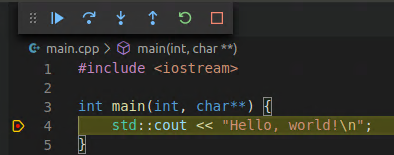

# VScode中调试C++（Linux）

[[toc]]

## 1.配置VScode使用GCC C++编译器(g++)和GDB debugger

1. 下载VSCode

2. 安装C++插件（搜索'c++'）

   

3. 检查gcc是否安装

   ```bash
   gcc -v
   ```

   如果没有安装，需要安装:

   ```bash
   sudo apt-get update
   sudo apt-get install build-essential gdb
   ```

4. 打开C++项目

5. 选择 **Terminal** > **Configure Default Build Task** ，然后选择 . Choose **C/C++: g++ build active file**.

   这一步会在 `.vscode`文件夹中创建一个 `tasks.json` 文件

6. 编译(根据tasks.json的配置编译):  press `Ctrl+Shift+B ` or from the **Terminal** main menu choose **Run Build Task**.

7. 调试:  From the main menu, choose **Run** > **Add Configuration...** and then choose **C++ (GDB/LLDB)**.

   这一步会创建一个 `launch.json` 文件

8. 开始调试

   选中一个CPP文件，按下`F5`或选择  **Run > Start Debugging**

## 2. CMake工具

1. 安装‘‘cmake tools’插件

   

2. 检查cmake是否安装

   ```bash
   cmake --version
   ```

   如果没有安装，需要先安装cmake：

   [Kitware APT Repository](https://apt.kitware.com/). 

   To add the repository to your installation, do the following in order:

   1. If you are using a [minimal](https://wiki.ubuntu.com/Minimal) Ubuntu image or a Docker image, you may need to install the following packages:

      ```
      sudo apt-get update
      sudo apt-get install apt-transport-https ca-certificates gnupg software-properties-common wget
      ```

   2. Obtain a copy of our signing key:

      ```
      wget -O - https://apt.kitware.com/keys/kitware-archive-latest.asc 2>/dev/null | gpg --dearmor - | sudo tee /etc/apt/trusted.gpg.d/kitware.gpg >/dev/null
      ```

   3. Add the repository to your sources list and update.

      For Ubuntu Focal Fossa (20.04):

      ```
      sudo apt-add-repository 'deb https://apt.kitware.com/ubuntu/ focal main'
      sudo apt-get update
      ```

      For Ubuntu Bionic Beaver (18.04):

      ```
      sudo apt-add-repository 'deb https://apt.kitware.com/ubuntu/ bionic main'
      sudo apt-get update
      ```

      For Ubuntu Xenial Xerus (16.04):

      ```
      sudo apt-add-repository 'deb https://apt.kitware.com/ubuntu/ xenial main'
      sudo apt-get update
      ```

   4. As an optional step, if you would like to subscribe to release candidates in addition to production releases, you can add our release candidate repository to your sources.

      For Ubuntu Focal Fossa (20.04):

      ```
      sudo apt-add-repository 'deb https://apt.kitware.com/ubuntu/ focal-rc main'
      sudo apt-get update
      ```

      For Ubuntu Bionic Beaver (18.04):

      ```
      sudo apt-add-repository 'deb https://apt.kitware.com/ubuntu/ bionic-rc main'
      sudo apt-get update
      ```

      For Ubuntu Xenial Xerus (16.04):

      ```
      sudo apt-add-repository 'deb https://apt.kitware.com/ubuntu/ xenial-rc main'
      sudo apt-get update
      ```

      Note that if you add the release candidate repository, *you will still need to add the main repository as well*, as the release candidate repository does not provide production releases on its own.

   5. As an optional step, we recommend that you also install our `kitware-archive-keyring` package to ensure that your keyring stays up to date as we rotate our keys. Do the following:

      ```
      sudo apt-get install kitware-archive-keyring
      sudo rm /etc/apt/trusted.gpg.d/kitware.gpg
      ```

   Now you can install any package from our APT repository. As an example, try installing the `cmake` package:

   ```
   sudo apt-get install cmake
   ```

3. 检查gcc是否安装了（同上）

4. 创建CMake项目

   Open the Command Palette (Ctrl+Shift+P) and run the **CMake: Quick Start** command:

5. Select a kit: 配置Cmake tools，使其知道系统中的编译器

   1. Open the Command Palette (`Ctrl+Shift+P`) and run **CMake: Select a Kit**. The extension will automatically scan for kits on your computer and create a list of compilers found on your system.

   2. Select the compiler you want to use. For example, depending on the compilers you have installed, you might see something like:

      


6. Select a variant: 如何编译项目

   To select a variant, open the Command Palette (Ctrl+Shift+P) run the **CMake: Select Variant** command.

   

   Select **Debug** to include debug information with your build.

   

   

7. CMake: Configure: 配置项目

   Now that you've selected a kit and a variant, open the Command Palette (Ctrl+Shift+P) and run the **CMake: Configure** command to configure your project. This generates build files in the project's build folder using the kit and variant you selected.

8. 编译项目

   After configuring your project, you're ready to build. Open the Command Palette (Ctrl+Shift+P) and run the **CMake: Build** command, or select the **Build** button from the Status bar.

   

9. debug

   To run and debug your project, open `main.cpp` and put a breakpoint on the `std::cout` line. Then open the Command Palette (Ctrl+Shift+P) and run **CMake: Debug**. The debugger will stop on the `std::cout` line:

   

## 如何添加调试参数

 在 launch.json 的 configurations.args中添加:

```json
{
    "configurations": {
        "args": [
            "-arg1","value","-arg2","value2"
        ]
    }
}
```

> 这种方式对与cmake无效

添加cmake调试参数, 在settings.json中添加如下配置:

```bash
# settings.json
{
    "cmake.debugConfig": {
        "args": [
            "-k", "25",
            "-p", 
            "-f", "\"/home/sheng/workspace/chia/chiapos-debug/plots/plots.dat\"",
            "-d", "/home/sheng/workspace/chia/chiapos-debug/plots",
            "-t", "/home/sheng/workspace/chia/chiapos-debug/tmp/plots",
            "-m", "\"0x1234\"",
            "create"
        ]
    }
}
```

> https://github.com/microsoft/vscode-cmake-tools/issues/121

## 参考

[Using C++ on Linux in VS Code](https://code.visualstudio.com/docs/cpp/config-linux)

